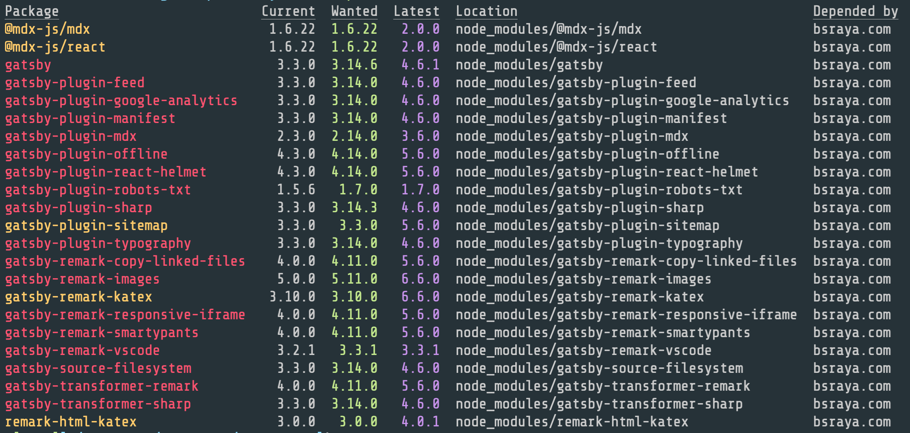

# Personal Website


Hey, I am Bijon Setyawan Raya. This website works as my resume and my blogging site. I mostly blog about ML and DL related topics. 

[Click here](https://bsraya.com/) to see my personal website.


This website is made with Gatsby.js. If you want to use this website as a template for your personal website, simply run

```bash
git clone https://github.com/nathansetyawan96/bsraya.com
npm install
npm run dev
```

# On-going Issues

1. Use [Theme UI](https://theme-ui.com) instead
2. Dependencies that need to be updated.
     
3. After updating `remark-katex-html` from `3.0.0` to `4.0.1`, there will be an error occured.
    ```bash
    Error: [ERR_REQUIRE_ESM]: require() of ES Module /Users/bijonsetyawan/Documents/git-repos/bsraya.com/node_modules/remark-html-katex /index.js from /Users/bijonsetyawan/Documents git-repos/bsraya.com/gatsby-config.js not supported.

    Instead change the require of index.js in /Users/bijonsetyawan/Documents/git-repos/bsraya.com/gatsby-config.js to a dynamic import() which is available in all CommonJS modules.
    ```

# Solved Issues

1. Updated dependencies
    ```bash
    @fortawesome/react-fontawesome
    katex
    prettier
    react-typography
    ```
2. `warn Browserslist: caniuse-lite is outdated.`
    
    Solution:
    
    `npx browserslist@latest --update-db`
3. Use of deprecated folder mapping "./"
    
    Error:
    ```bash
    ERROR 
    (node:28120) [DEP0148] DeprecationWarning: Use of deprecated folder mapping "./" in the "exports" field module resolution of the package at /Users/bijonsetyawan/Documents/git-repos/bsraya.com/node_modules/css-loader/node_modules/postcss/package.json. Update this package.json to use a subpath pattern like "./*". (Use `node --trace-deprecation ...` to show where the warning was created)

    ERROR 
    (node:28120) [DEP0148] DeprecationWarning: Use of deprecated folder mapping "./" in the "exports" field module resolution of the package at /Users/bijonsetyawan/Documents/git-repos/bsraya.com/node_modules/postcss/package.json. Update this package.json to use a subpath pattern like "./*".
    ```

    Solution:
    ```bash
    npm install --save postcss@latest 
    ```
4. Error:
    ```
    /Users/bijonsetyawan/Documents/git-repos/bsraya.com/node_modules/gatsby-recipes/dist/graphql-server server.js:24
    var remarkMdx = require('remark-mdx');
                    ^

    Error [ERR_REQUIRE_ESM]: require() of ES Module
    /Users/bijonsetyawan/Documents/git-repos/bsraya.com/node_modules/remark-mdx/index.js from /Users/bijonsetyawan/Documents/git-repos/bsraya.com/node_modules/gatsby-recipes/dist/graphql-server/server.js not supported.
    Instead change the require of index.js in /Users/bijonsetyawan/Documents/git-repos/bsraya.com/node_modules/gatsby-recipes/dist/graphql-server/server.js to a dynamic
    import() which is available in all CommonJS modules.
        at Object.<anonymous>
    (/Users/bijonsetyawan/Documents/git-repos/bsraya.com/node_modules/gatsby-recipes/dist/graphql-server/server.js:24:17) {
    code: 'ERR_REQUIRE_ESM'
    }
    ```
    
    Solution:

    * Remove `package-lock.json`
    * Remove `./.cache`, `./public`, and `./node_modules`