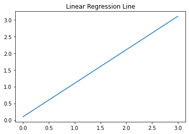
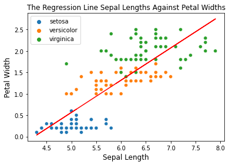

In this post, we are going to create three versions on Gradient Descent implementation, such as:

1. Gradient Descent
2. Mini-Batch Gradient Descent
3. Stochastic Gradient Descent

There are several equations that we need to familiar with before working on these implementations.

Let $y$ be the actual target, or label, and $\hat{y}$ be the prediction target.

First, it's Mean Squared Error, or MSE, which is the cost function we are going to minimize.

$$
    \text{MSE} = \frac{1}{N} \sum_{i=1}^N (\hat{y}_i - y_i)^2
$$

From the MSE equation, we then have a cost function for Gradient Descent which means how far, or the error, the predictions from the regression line.
The further the data are from the regression line, the larger the cost function value.
We should minimize the cost function denoted as $J(\Theta_0, \Theta_1)$ where it is equivalent to

$$
    \frac{1}{2N} \sum_{i=1}^N (\hat{y}_i - y_i)^2
$$

Second, it's regression line equation, and it goes like

$$
    y = a_0 + a_1 \times x_1
$$

where $a_0$ is the intercept and $a_1$ is the first coefficient. Most people know this equation as

$$
    y = mx + b
$$

where $y$ is the prediction, $m$ is the first coefficient and $b$ is the intercept.
If we plot the equation above, it's going to look like the figure below.



Last, the equation for updating the weight.

$$
\Theta_{i} = \Theta_i - \alpha \times \frac{\partial}{\partial \Theta_i} J(\Theta_0, \Theta_1)
$$

where

1. $\Theta_{i}$ is the weight
2. $\alpha$ is the learning rate
3. $J(\Theta_0, \Theta_1)$ is the cost function with respect to the weights

Let's simplify the partial derivation in the equation above

$$
    \frac{\partial}{\partial \Theta_i} J(\Theta_0, \Theta_1)
$$

$$
    \frac{\partial}{\partial \Theta_i} \frac{1}{2N} \sum_{i=1}^N (\hat{y}_i - y_i)^2
$$

Solving the partial derivation above, we then have

$$
    \frac{\partial}{\partial \Theta_i} J(\Theta_0, \Theta_1) = \frac{1}{N} (\hat{y}_i - y_i) \times x_i
$$

Plugging the result back to the original function, we have

$$
\Theta_{i} = \Theta_i - \frac{\alpha}{N} \sum^{N}_{i=1} (\hat{y}_i - y_i) \times x_i
$$

After getting ourselves familiar with these 3 things, let's delve right into the implementations.
Before we start with the implemetations, we should first import the dataset from `sklearn`.
In this project, we will be working with the iris dataset.

```python:title=data-preparation
from sklearn import datasets

iris = datasets.load_iris()
features = iris.data
target = iris.target

sepal_length = np.array(features[:, 0])
petal_width = np.array(features[:, 3])

species_names = list()

for i in target:
    if i == 0:
    species_names.append('setosa')
    elif i == 1:
    species_names.append('versicolor')
    else:
    species_names.append('virginica')
```

# 1. Gradient Descent

First, let's fit our dataset to `LinearRegression()` model that we imported from `sklearn.linear_model`.

```python:title=visualize-scikit-lr-results
reg = LinearRegression().fit(X = sepal_length.reshape(-1,1), y = petal_width.reshape(-1,1))

sns.scatterplot(x = sepal_length, y = petal_width, hue = species_names)

plt.plot(
    sepal_length,
    reg.intercept_[0] + reg.coef_[0][0] * features[:, 0],
    color='red'
)
```

Once we have done fitting, or training, we then visualize the result.



# 2. Mini-Batch Gradient Descent

# 3. Stochastic Gradient Descent

```

```
