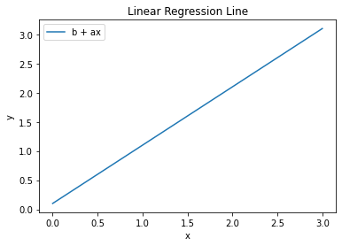

In this post, we are going to create three versions on Gradient Descent implementation, such as:

1. Gradient Descent
2. Mini-Batch Gradient Descent
3. Stochastic Gradient Descent

There are several equations that we need to familiar with before working on these implementations.

1. Mean Squared Error, or MSE, which is the cost function we are going to minimize.

   $$
      \text{MSE} = \frac{1}{N} \sum_{i=1}^N (\text{predicted}_i - \text{actual}_i)^2
   $$

   From the MSE equation, we have a cost function that we should minimize

   $$
    J(\Theta_0, \Theta_1) = \frac{1}{2N} \sum_{i=1}^N (\text{predicted}_i - \text{actual}_i)^2
   $$

2. The regression line equation which goes like

   $$
       y = a_0 + a_1 \times x_1
   $$

   where $a_0$ is the intercept and $a_1$ is the first coefficient. Most people know this equation as

   $$
       y = mx + b
   $$

   where $m$ is first coefficient and $b$ is the intercept. In plain English, the equation looks like

   $$
       \text{predicted} = \text{intercept} + \text{1st coefficient} \times \text{1st feature}
   $$

   If we plot the equation above, it's going to look like the figure below.

   

3. The equation for updating the weight is

   $$
    \Theta_{i+1} = \Theta_i - \alpha \times \frac{\partial}{\partial \Theta_i} J(\Theta_0, \Theta_1)
   $$

   where

   1. $\Theta_{i+1}$ is the updated weight
   2. $\Theta_{i}$ is the current weight
   3. $\alpha$ is the learning rate
   4. $J(\Theta_0, \Theta_1)$ is the cost function with respect to the weights

   Let's simplify the partial derivation in the equation above

   $$
    \frac{\partial}{\partial \Theta_i} J(\Theta_0, \Theta_1) = \frac{\partial}{\partial \Theta_i} \frac{1}{2N} \sum_{i=1}^N (\text{predicted}_i - \text{actual}_i)^2
   $$

   Solving the partial derivation above, we then have

   $$
    \frac{\partial}{\partial \Theta_i} J(\Theta_0, \Theta_1) = \frac{1}{N} (\text{predicted}_i - \text{actual}_i) \times x_i
   $$

   Plugging the result back to the original function, we have

   $$
    \Theta_{i+1} = \Theta_i - \frac{\alpha}{N} \sum^{N}_{i=1} (\text{predicted}_i - \text{actual}_i) \times x_i
   $$

After getting ourselves familiar with these 3 things, let's delve right into the implementations.
Before we start with the implemetations, we should first import the dataset from `sklearn`.
In this project, we will be working with the iris dataset.

```python:title=data-preparation
from sklearn import datasets

iris = datasets.load_iris()
features = iris.data
target = iris.target

sepal_length = np.array(features[:, 0])
petal_width = np.array(features[:, 3])

species_names = list()

for i in target:
    if i == 0:
    species_names.append('setosa')
    elif i == 1:
    species_names.append('versicolor')
    else:
    species_names.append('virginica')
```

# 1. Gradient Descent

First, let's fit our dataset to `LinearRegression()` model that we imported from `sklearn.linear_model`.

```python:title=visualize-scikit-lr-results
reg = LinearRegression().fit(X = sepal_length.reshape(-1,1), y = petal_width.reshape(-1,1))

sns.scatterplot(x = sepal_length, y = petal_width, hue = species_names)

plt.plot(
    sepal_length,
    reg.intercept_[0] + reg.coef_[0][0] * features[:, 0],
    color='red'
)
```

Once we have done fitting, or training, we then visualize the result.


# 2. Mini-Batch Gradient Descent

# 3. Stochastic Gradient Descent

```

```
