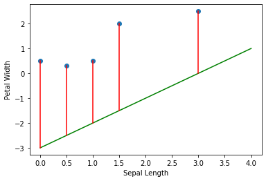
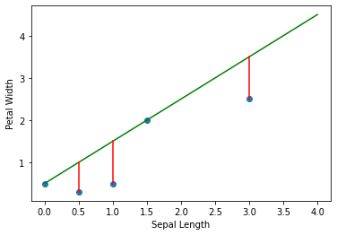

import { Link } from 'gatsby'

# Linear Regression

I am sure most of you reading this post right now are familiar with the following graph,
and we did use $y = b + ax$ equation in high school or college to find the distance between two points in a 2D coordinate.

Not it is able to determine the distance between two points, but it can used to get a machine learning model to learn better.

Let's say that we have an Iris dataset from `sklearn-learn`. Plotting it will give us the following visualization.

Clearly, we can see that there are two features involved in the classification: `sepal_length` and `petal_width`.

The relationship between these two features can be written as follow.

$$
    y = \beta_0 + \beta_1 \times x
$$

You should know that the intercept or $\beta_0$ is the lowest value in the line.
If $\beta_0 = 0$, the lowest value $y$ can get is $0$.

Expressing the equation like we did above is quite cryptic for people who don't have strong mathematical background.
Since we are using the Iris Dataset, we can translate the equation into a more readable form.

$$
    \text{petal width} = \beta_0 + \beta_1 \times \text{sepal length}
$$

From these two features, you want to see their correlations whether `sepal_length` and `petal_width` are correlated or inversely correlated.

`sepal_length` and `petal_width` are said to be correlated when `sepal_length` increases, the `petal_length` also increases.
Conversely, `sepal_length` and `petal_width` are said to be inversely correlated when `sepal_length` increases, but the `petal_width` decreases.

With a regression line, it can help us to predict the $y$ value given a single $x$ value.
However, most predictions made by the regression line is not always accurate like in the graph below.
Let's see an example down below where datapoints are far from the regression line.

When the regression line, which is the green line, sees $x = 0$ then it predicts $y = -3$. 
In reality, $y$ should be $0.5$ when $x = 0$. Meaning that our regression line is very bad at prediction.
Since our regression line is bad at predicting, that indicates that we have a huge Mean Squared Erorr value.

Mean Squared Error (MSE) has always been used to measure the quality of regression lines.
Mean Squared Error is the sum of the squared difference from the regression line to the actual value.

$$
MSE = \frac{1}{n} \sum_{i=1}^{n} (\hat{y}_i - y_i)^2
$$

where $n$ is the number of data points, $\hat{y}_i$ is the predicted value, and $y_i$ is the actual value.

The larger the MSE, the worse the regression line. In the example above, we will have a large MSE since most data points are far from the regression line.

$$
    \begin{aligned}
        MSE &= \frac{47.59}{5} \\
        &= 9.518
    \end{aligned}
$$

Let's see another example where the data points are close to the regression line.

In this example, we can see that the new regression line is much better at prediction compared to the previous one.
Since most data points are closer to the regression line, the MSE of our regression line is relatively smaller compared to the previous one.
Let's calculate the MSE for this example.

$$
    \begin{aligned}
        MSE &= \frac{1.74}{5} \\
        &= 0.348
    \end{aligned}
$$

After seeing two example, you might be wondering **how do we find the best value for $\beta_0$ and $\beta_1$ so that the regression line can have a small MSE?**

One way, we can find the best values for $\beta_0$ and $\beta_1$ by mere guessing.
However, it is going to take a significant amount of time.
If we did so, it would be a tedious job to do.

However, there is another way! That way is to use the help of Calculus to find the best values for $\beta_0$ and $\beta_1$ by updating those two values over time.
If you are interested on how to do this, please check out <Link to="/blog/part-1-mathematics-of-gradient-descent">this series on Gradient Descent</Link>.