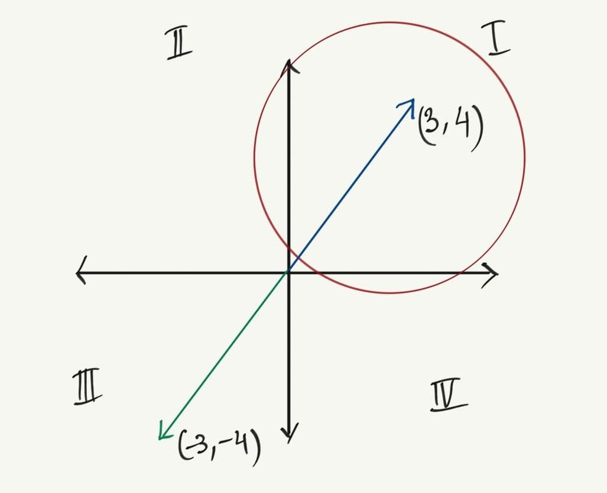

This blog post is my note while learning Linear Algebra along the way.
Make sure you are familiar with some math symbols. I will keep updating the content of this page from time to time.

Before reading the rest of the post, you should know a few things.

The word “vector” should not be with the 
confused with arrow representations mostly used in Linear Algebra textbooks. In this blog post, the word “vector” 
is being used to describe any element of a vector space.

For simplicity, let $+$ be addition, $-$ substraction, $\times$ multiplication, and $\div$ division.

You should be familiar with some sets of numbers, namely:
1. Integer numbers $\mathbb{Z}$
2. Real numbers $\mathbb{R}$
3. Natural numbers $\mathbb{N}$
4. Complex numbers $\mathbb{C}$

# 1. Vector spaces

## 1.1 Vector Space 
Before defining what vector space is, we should know what a group $\mathbb{G}$ and a field $\mathbb{F}$ are.

Let $\mathbb{S}$ be a set of numbers, and $\circ$ an arbitrary operation.
$(\mathbb{S}, \circ)$, or a set of numbers under any arbitrary operation, is considered to be a group $\mathbb{G}$ if
1. The operation is closed, meaning that for all $x,y$ in $\mathbb{S}$ such that $x+y$ is also in $\mathbb{S}$
2. The set has an unique identity, in other words $e + x = x + e = x$
3. Every element in the set has an inverse
4. Associative property exists

Take a set of integers for an example. 
As for $1+1$, $1$ and the result $2$ are elements of $\mathbb{Z}$. Thus, $\mathbb{Z}$ is a group under $+$.
However, $\mathbb{Z}$ is not a group under $\times$ because 

A field $\mathbb{F}$ is a set of numbers where $+$, $-$, $\times$, and $\div$ can be done on them, and the result should be in the same set as well.
For clarity, let's take a set of integer numbers again this time.
We have proven that $+$ and $\times$ hold. We want to see if $-$ and $\div$ also hold.

The best known fields are the field of real numbers $\mathbb{R}$ and the field of complex numbers $\mathbb{C}$.
That's why we often see a vector space over $\mathbb{R^n}$ and $\mathbb{C^n}$ since both of them are considered practical and widely used in many engineering fields, especially in Electrical Engineering and Computer Science.

Vector space, denoted by $V$, is a combination of a group and a field. 
In the vector space, the elements of the group are called vectors. 
While the elements of the field are called scalars. 

In other words, a vector space is a collection of vectors where addition and scalar multiplication can be done on those vectors.

We know that we can do $+$, $-$, $\times$, and $\div$ on scalars since the result is a scalar which is a field. In other words, any operations on two field elements will map to a field.
Conversely, we can only do $+$ and $\times$ on vectors and the result is a vector which is a group. Simply said, $+$ and $\times$ operations on two group elements will map to a group.

However, there is a restriction on a scalar multiplication on a vector. 
Take $ax = b$ for an example, where $a$ is a scalar thus an element of a field. While $x, b$ are vectors thus elements of a group.
Remember, we can't have a scalar multiplication on a vector and the result is in a field. Meaning that the result is not a vector since vectors are in a group.
Thus, we have to redefine the $\times$ operation on a scalar and a group. Scalar multiplication is an operation that maps a scalar (field) and on a vector (group) to a vector (group).

Let's take a vector space over $\mathbb{R}^n$. Meaning, the group is all the vectors exist in this vector space.
While the field is real numbers in $\mathbb{R}$, and they $\mathbb{R}$ are scalars.
Take $1.2$ for an example. Since $1.2$ is an element in the field of real numbers $\mathbb{R}$, then $1.2$ is a scalar.
Since $1.2$ is a scalar, we can multiply scalar $1.2$ with any vector in the vector space.

However, a space can be considered a vector space if it can satisfy these 9 conditions:

1. $\forall x,y \in V$, $x+y = y+x$ (commutative)
2. $\forall x,y,z \in V$, $(x+y)+z = x+(y+z)$ (associativity)
3. There exists an element in $V$ denoted by $0$ such that $x + 0 = x$ for each $x$ in $V$
4. For each  $x \in V$, $\exists y \in V$ such that $x+y = 0$
5. For each $x \in V$, $1 \cdot x = x$
6. For each pair of $a, b \in \mathbb{F}$ and each $x \in V$, $(a \cdot b) \cdot x = a \cdot (b \cdot x)$
7. For each $a \in \mathbb{F}$ and each pair of $x,y \in V$, $a \cdot (x+y) = a \cdot x + a \cdot y$
8. For each pair of $a,b \in \mathbb{F}$ and each $x \in V$, $(a+b) \cdot x = a \cdot x + b \cdot x$
9. If $x \neq 0$, then $\exists x^{-1} ∈ \mathbb{F}$ such that $x \cdot x^{-1} = 1$ (existence of multiplicative inverses)

Simply said, these rules exist just to make sure that the vectors that you do operations on and the resultant vector are in the same vector space.
If the vectors that you do operations on are in the same vector space, but the resultant vector isn't. Clearly, the space is not a vector space.

Here is an example:

Let the first quadrant be a vector space, and we multiple a vector $(3,4)$ with a scalar $-1$. We end up having a resultant located outside the vector space.
Thus, the first quadrant is not a vector space.

What about a field of $\mathbb{Z}$ and a field of $\mathbb{N}$? Aren't they also vector spaces?

1. $\mathbb{Z}$ is not a vector space because $2 \in \mathbb{Z}$ but $\frac{1}{2} \notin \mathbb{Z}$. Clearly, it violates the rule number 9.
2. $\mathbb{N}$ is not a vector space because $0 \notin \mathbb{N}$. Clearly, it violates the rule number 3 saying that "there exists an element in $V$ denoted by $0$".

So, what do vector spaces over $\mathbb{R}^n$ and $\mathbb{C}^n$ mean?

1. $\mathbb{R}^n$ is an n-dimensional vector space where the coordinates of each vector in the space are expressed in real numbers.
2. $\mathbb{C}^n$ is an n-dimensional vector space where the coordinates of each vector in the space are expressed in complex numbers.

In the examples below, note that each column in the matrices are distinct vectors, and the number of rows are the number of dimensions in vector space.

Here are some examples of $\mathbb{R}^n$
$$$
\mathbb{R}^1 = 
\begin{pmatrix} 
1 & 2
\end{pmatrix} 
$$$

$$$
\mathbb{R}^2 = 
\begin{pmatrix} 
1 & 2 \\ 
3.45 & 4.56 
\end{pmatrix}
$$$

$$$
\mathbb{R}^3 = 
\begin{pmatrix} 
1 & 2 \\ 
3.45 & 4.56 \\
\sqrt{1.2} & (3.45)^{1.2} 
\end{pmatrix}
$$$

Here are some examples of $\mathbb{C}^n$

$$$
\mathbb{C}^1 = 
\begin{pmatrix} 
i & 2i 
\end{pmatrix}
$$$

$$$
\mathbb{C}^2 = 
\begin{pmatrix} 
i & 2i \\
1 + 21 & 2 + 3i 
\end{pmatrix}
$$$

$$$
\mathbb{C}^3 = 
\begin{pmatrix} 
i & 2i \\
1 + 21 & 2 + 3i \\
3 + 3i & 1 + 1.5i
\end{pmatrix}
$$$

Each element in $\mathbb{C}^n$ should be in a form of $a+bi$, where $a$ and $b$ are real numbers and $i$ is an imaginary number. 
In addition, $b \neq 0$. Otherwise, it won't be a complex number since $a+0i$ is a real number.

## 1.2 Subspaces