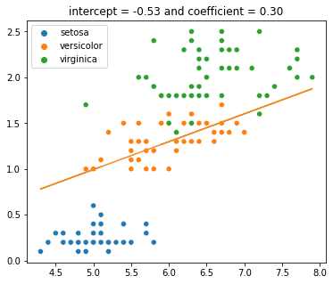
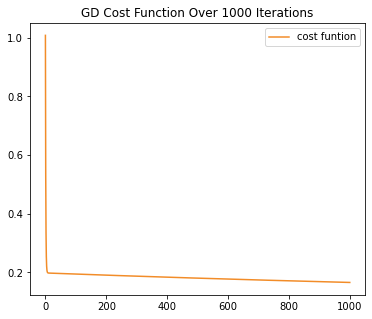
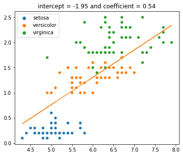
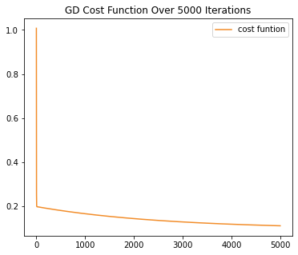
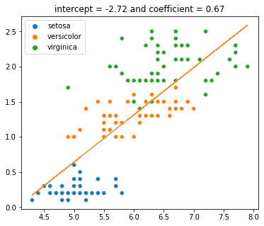
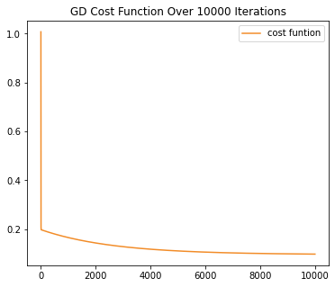

import { Link } from 'gatsby';

This is part 1 of the series on Gradient Descent.

- <Link to="/blog/part-2-batch-gradient-descent">
    Part 2: Batch Gradient Descent
  </Link>
- <Link to="/blog/part-3-stochastic-gradient-descent">
    Part 3: Stochastic Gradient Descent
  </Link>

There are several equations that we need to familiar with before working on these implementations, 
namely: **Mean Squared Error**, **the regression line equation**, and **the parameter update equation**.

First, it's **Mean Squared Error** (MSE) which is the cost function we are going to minimize. 
Let $y$ be the actual label, and $\hat{y}$ be the prediction label. 

$$
    \text{MSE} = \frac{1}{N} \sum_{i=1}^N (\hat{y}_i - y_i)^2
$$

The equation above is the cost function for Gradient Descent that we want to minimize.
The equation means the sum of the distances of the predictions from the regression line.
The distances are the errors. The further the data are from the regression line, the larger the cost function value, and vice versa.
The cost function is denoted as $J(\Theta_0, \Theta_1)$ where

$$
    \frac{1}{2N} \sum_{i=1}^N (\hat{y}_i - y_i)^2
$$

Second, it's **regression line equation**, and it goes like

$$
    y = a_0 + a_1 \cdot x_1
$$

where $a_0$ is the intercept and $a_1$ is the first coefficient. Most people know this equation as

$$
    y = mx + b
$$

where $y$ is the prediction, $m$ is the first coefficient and $b$ is the intercept.
If we plot the equation above, it's going to look like the figure below.


Last, **the parameter update equation**. In this example, the intercept and the first coefficient are the parameters that we want to update over time.

$$
\Theta_{i} = \Theta_i - \alpha \cdot \frac{\partial}{\partial \Theta_i} J(\Theta_0, \Theta_1)
$$

where

1. $\Theta_{i}$ is the weight
2. $\alpha$ is the learning rate
3. $J(\Theta_0, \Theta_1)$ is the cost function with respect to the weights

Let's simplify the partial derivation in the equation above

$$
    \frac{\partial}{\partial \Theta_i} J(\Theta_0, \Theta_1) = \frac{\partial}{\partial \Theta_i} \frac{1}{2N} \sum_{i=1}^N (\hat{y}_i - y_i)^2
$$

Solving the partial derivation above, we then have

$$
    \frac{\partial}{\partial \Theta_i} J(\Theta_0, \Theta_1) = \frac{1}{N} (\hat{y}_i - y_i) \cdot x_i
$$

Plugging the result back to the original function, we have

$$
\Theta_{i} = \Theta_i - \frac{\alpha}{N} \sum^{N}_{i=1} (\hat{y}_i - y_i) \cdot x_i
$$

Before we start with the implemetations, we should first import the iris dataset from `sklearn`.

```python {numberLines}
from sklearn.datasets import load_iris

iris = load_iris()
features = iris.data
target = iris.target

sepal_length = np.array(features[:, 0])
petal_width = np.array(features[:, 3])

species_names = list()

for i in target:
    if i == 0:
    species_names.append('setosa')
    elif i == 1:
    species_names.append('versicolor')
    else:
    species_names.append('virginica')
```

First, let's fit our dataset to `python:LinearRegression()` model that we imported from `python:sklearn.linear_model`.

```python {numberLines}
linreg = LinearRegression()

linreg.fit(
    X = sepal_length.reshape(-1,1), 
    y = petal_width.reshape(-1,1)
)

sns.scatterplot(
    x = sepal_length, 
    y = petal_width, 
    hue = species_names
)

plt.plot(
    sepal_length,
    linreg.intercept_[0] + 
    linreg.coef_[0][0] * features[:, 0],
    color='red'
)
```

Let's see the intercept and the coefficient that `python:LinearRegression()` produced from our dataset.
We are also want to see how much the MSE is, so let's print that as well.

```python {numberLines}
print(linreg.intercept_, linreg.coefficient_)
# [-3.200215] [[0.75291757]]

linreg_predictions = linreg.predict(sepal_length.reshape(-1,1))
linreg_mse = mean_squared_error(linreg_predictions, petal_width)
print(f"Linear Regression's MSE is {linreg_mse}")
# Linear Regression's MSE is 0.19101500769427357
```

From the result we got from `python:sklearn`, the best regression line is

$$
    y = -3.200215 + 0.75291757 \cdot x
$$

where most data points are located near it.


# Gradient Descent

$$
    \Theta_{i} = \Theta_i - \frac{\alpha}{N} \sum^{N}_{i=1} (\hat{y}_i - y_i) \cdot x_i
$$

The equation above is the heart of entire algorithm.
Let's denote the intercept $b_0$ and the first coefficient be $b_1$.
Since we have two weights that we have to update over time, we have to change $\Theta_i$ to the variables we intend to use.
In this case, they are $b_0$ and $b_1$.

$$
    b_0 = b_0 - \frac{\alpha}{N} \sum^{N}_{i=1} (\hat{y}_i - y_i)
$$

and to update the first coefficient

$$
    b_1 = b_1 - \frac{\alpha}{N} \sum^{N}_{i=1} (\hat{y}_i - y_i) \cdot x_i
$$

Converting those two equations above to python code, we then have

```python {7-10, numberLines}
def gd(x, y, epochs, df, alpha = 0.01):
    length = len(x)
    intercept, coefficient = 0.0, 0.0
    for epoch in range(epochs):
        sum_error = 0.0
        predictions = predict(intercept, coefficient, x)
        b0_error = (1/length) * np.sum(predictions - y)
        b1_error = (1/length) * np.sum((predictions - y) * x)
        intercept = intercept - alpha * b0_error
        coefficient = coefficient - alpha * b1_error
        sum_error = sum_error + np.sum((predictions - y) ** 2) / (2 * length)
        df.loc[epoch] = [intercept, coefficient, sum_error]
    return df
```

Then we create a dataframe to store the result and run the `python:gd()` function for over 10000 times.

```python {numberLines}
gd_loss = pd.DataFrame(columns=['intercept', 'coefficient', 'sum_error'])
gd_loss = gd(sepal_length, petal_width, epochs = 10000, df = gd_loss)
```

Let's see how the regression lines tend to look like at the 1000th, the 5000th, and the 1000th iterations.

# 1000 Iterations

```python {numberLines}
epoch = 1000
calculate_mse(
    'GD',
    gd_loss['intercept'].loc[epoch-1],
    gd_loss['coefficient'].loc[epoch-1]
)
scatter_plot_with_regression_line(gd_loss['intercept'].loc[epoch-1], gd_loss['coefficient'].loc[epoch-1])
sum_err_graph('GD', gd_loss, epoch)
```





With over 1000 iterations, the MSE value is $0.3309592484431454$.

# 5000 Iterations





The MSE value is `0.2215636705284282`.

# 10000 Iterations





The MSE value is `0.19557315833450503`.

After 10000 iterations, our GD's MSE, `0.19557315833450503`, is quite close to Scikit-Learn's Linear Regression's MSE which is `0.19101500769427357`.

Combining everything, here is how the regression line changes over time.


Let's animate the movement of the regression lines.


For more details, [click here](https://www.kaggle.com/bijonsetyawan/part-1-gradient-descent) to check the notebook on Kaggle.