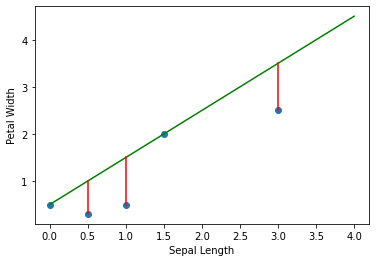
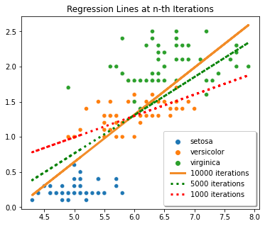
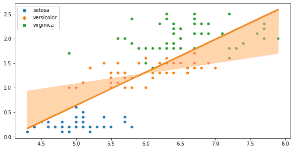

import { Link } from 'gatsby';

This is part 1 of the series on Gradient Descent.

- <Link to="/blog/part-2-batch-gradient-descent">
    Part 2: Batch Gradient Descent
  </Link>
- <Link to="/blog/part-3-stochastic-gradient-descent">
    Part 3: Stochastic Gradient Descent
  </Link>

# Introduction

First of all, let's get a bit familiar with the concept of a gradient line.

I am sure most of you reading this post right now are familiar with the following graph,
and we have been using it in high school or college to find the distance between two points in 2D coordinates.


Looking at this graph, especially the equation, left us wondering and ask "when is the time to apply this equation in real life problems?"

Let's say that we have an `iris` dataset from `sklearn`. Plotting it will give us the following visualization.


Clearly, we can see that there are two features involved in the classification: `sepal_length` and `petal_width`.

From these two features, you want to see their correlations whether they are correlated or inversely correlated.

`sepal_length` and `petal_width` are said to be correlated when `sepal_length` increases, the `petal_length` increases.
Conversely, `sepal_length` and `petal_width` are said to be inversely correlated when `sepal_length` increases, the `petal_width` decreases.


With the regression line, it can help us to predict a $y$ value given a $x$ value.
However, most predictions made by the regression line is not always accurate like in the graph below.


With the green line, which is our regression line, when we have $x = 0$ then $y = -3$. 
In reality, when $x = 0$, $y$ should be $0.5$. 
Meaning that our regression line is very bad at prediction.

We can also use Mean Squared Error (MSE) to measure the quality of our regression line.
Mean Squared Error is the sum of the squared difference from the regression line to the actual value.

$$
    \text{MSE} = \sum_{i=1}^N (\hat{y}_i - y_i)^2
$$

The larger the MSE, the worse the regression line. In this example, we will have a large MSE since most data points are far from the regression line.

Let's see another example where the data points are close to the regression line.



In this example, we can see that our regression line can predict the value of $y$ accurately at two $x$ values, namely at $0$ and $1.5$.
Clearly, the MSE of our regression line is very small compared to the previous one.

The question is, how can we find the best regression line? We know that the equation for the regression line is $y = b + mx$ or can be written as $y = b_0 + b_1 \times x$. 

One way, we can find the $b_0$ and $b-1$ values manually by mere guessing.
However, it is going to take a significant amount of time.

Another way is that we can use Calculus to help us to find the best values for $b_0$ and $b_1$ by updating those two values after each iteration.

# Mathematics of Gradient Descent

Remember that we want to have a regression line that is located as closer to most data points as possible. 
Meaning that we want to minimize the MSE value.

There are several equations that we need to familiar with before working on these implementations,
namely: **Mean Squared Error**, **the regression line equation**, and **the parameter update equation**.

First, it's **Mean Squared Error** (MSE) which is the cost function we are going to minimize.
Let $y$ be the actual label, and $\hat{y}$ be the prediction label.

$$
    \text{MSE} = \frac{1}{N} \sum_{i=1}^N (\hat{y}_i - y_i)^2
$$

The equation above is the MSE equation or the cost function for the Gradient Descent algorithm that we want to minimize.

The equation means the sum of the distances of the predictions from the regression line.
The distances are the errors. The further the data are from the regression line, the larger the cost function value, and vice versa.

The cost function is denoted as $J(\Theta_0, \Theta_1)$ where

$$
    \frac{1}{2N} \sum_{i=1}^N (\hat{y}_i - y_i)^2
$$

Second, it's **regression line equation**, and it goes like

$$
    y = b_0 + b_1 \cdot x
$$

where $y$ is the prediction, $b_0$ is the intercept and $b_1$ is the first coefficient. 

You can think the intercept is where the point starts, and the first coefficient determines the steepness and the direction of the line.

Last, **the parameter update equation**. In this example, $b_0$ and $b_1$ are the parameters that we want to update over time.

$$
\Theta_{i} = \Theta_i - \alpha \cdot \frac{\partial}{\partial \Theta_i} J(\Theta_0, \Theta_1)
$$

where

1. $\Theta_{i}$ is the coefficients we want to update
2. $\alpha$ is the learning rate
3. $J(\Theta_0, \Theta_1)$ is the cost function with respect to the weights

From this point, $b_0$ will be written as $\Theta_0$ and $b_1$ as $\Theta_1$.

Let's express everything we want as mathematical expressions.

The cost function
$$
    \begin{aligned}
    J(\Theta_0, \Theta_1) 
    &= \frac{1}{N} \sum_{i=1}^N (f(x) - y_i)^2  \\
    &= \frac{1}{N} \sum_{i=1}^N (\hat{y}_i - y_i)^2 \\
    &= \frac{1}{N} \sum_{i=1}^N (\Theta_0 + \Theta_1 x - y_i)^2
    \end{aligned}
$$

The objective function
$$
    \min_{\Theta_0, \Theta_1} J(\Theta_0, \Theta_1)
$$

The update rules
$$
    \Theta_{i} = \Theta_i - \alpha \cdot \frac{\partial}{\partial \Theta_i} J(\Theta_0, \Theta_1)
$$

Bear with me! This is going to involve a lot of Maths, especially Calculus.

Let's simplify the partial derivation in the equation above

$$
\begin{aligned}
    \frac{\partial}{\partial \Theta_i} J(\Theta_0, \Theta_1) 
    &= \frac{\partial}{\partial \Theta_i} (\frac{1}{N} \sum_{i=1}^N (f(x) - y_i)^2) \\
    &= \frac{1}{N} \frac{\partial}{\partial \Theta_i} \sum_{i=1}^N (f(x) - y_i)^2
\end{aligned}
$$

Solving the equality above with Power Rule, we then have
$$
    \begin{aligned}
        \frac{\partial}{\partial \Theta_i} J(\Theta_0, \Theta_1) 
        &= \frac{1}{N} \sum_{i=1}^N 2(f(x) - y_i) \frac{\partial}{\partial \Theta_i} (f(x) - y_i) \\
        &= \frac{2}{N} \sum_{i=1}^N (f(x) - y_i) \frac{\partial}{\partial \Theta_i} (f(x) - y_i) \\
    \end{aligned}
$$

Since we want to update the $\Theta_0$ and $\Theta_1$ coefficients, we need to find the partial derivative of the cost function with respect to those coefficients.

$$
    \begin{aligned}
        \frac{\partial}{\partial \Theta_0} J(\Theta_0, \Theta_1) 
        &= \frac{2}{N} \sum_{i=1}^N (f(x) - y_i) \frac{\partial}{\partial \Theta_0} (f(x) - y_i) \\
        &= \frac{2}{N} \sum_{i=1}^N (f(x) - y_i) \frac{\partial}{\partial \Theta_0} (\Theta_0 + \Theta_1 x - y_i) \\
        &= \frac{2}{N} \sum_{i=1}^N (f(x) - y_i)
    \end{aligned}
$$

$$
    \begin{aligned}
        \frac{\partial}{\partial \Theta_1} J(\Theta_0, \Theta_1) 
        &= \frac{2}{N} \sum_{i=1}^N (f(x) - y_i) \frac{\partial}{\partial \Theta_1} (f(x) - y_i) \\
        &= \frac{2}{N} \sum_{i=1}^N (f(x) - y_i) \frac{\partial}{\partial \Theta_1} (\Theta_0 + \Theta_1 x - y_i) \\
        &= \frac{2}{N} \sum_{i=1}^N (f(x) - y_i) x
    \end{aligned}
$$

We can also remove the $2$ from the two equations above by multiplying the cost function, in this case the MSE equation, by $\frac{1}{2}$.
Multiplying the cost function with a scalar will not affect its minimum value.

$$
    J(\Theta_0, \Theta_1) = \frac{1}{2N} \sum_{i=1}^N (\hat{y}_i - y_i)^2
$$

Since the $2$ is removed, 

$$
    \frac{\partial}{\partial \Theta_0} J(\Theta_0, \Theta_1) = \frac{1}{N} \sum_{i=1}^N (f(x) - y_i) \\
    \frac{\partial}{\partial \Theta_1} J(\Theta_0, \Theta_1) = \frac{1}{N} \sum_{i=1}^N (f(x) - y_i) x 
$$

Pluggin each of the equation above into the update rule with respect to those coefficients, we get
$$
    \Theta_{0} = \Theta_0 - \alpha \cdot \frac{1}{N} \sum_{i=1}^N (f(x) - y_i) \\
    \Theta_{1} = \Theta_1 - \alpha \cdot \frac{1}{N} \sum_{i=1}^N (f(x) - y_i) x 
$$

The two equations above will help us to approximate the minimum value of the cost function by updating $\Theta_{0}$ and $\Theta_{1}$ over time.
Now, let's translate those two equations above into Python code.

# Implementing Gradient Descent

Before we start with the implemetations, we should first import the iris dataset from `sklearn`.

```python
from sklearn.datasets import load_iris

iris = load_iris()
features = iris.data
target = iris.target

sepal_length = np.array(features[:, 0])
petal_width = np.array(features[:, 3])

species_names = list()

for i in target:
    if i == 0:
    species_names.append('setosa')
    elif i == 1:
    species_names.append('versicolor')
    else:
    species_names.append('virginica')
```

First, let's fit our dataset to `python:LinearRegression()` model that we imported from `python:sklearn.linear_model`.

```python
linreg = LinearRegression()

linreg.fit(
    X = sepal_length.reshape(-1,1),
    y = petal_width.reshape(-1,1)
)

sns.scatterplot(
    x = sepal_length,
    y = petal_width,
    hue = species_names
)

plt.plot(
    sepal_length,
    linreg.intercept_[0] +
    linreg.coef_[0][0] * features[:, 0],
    color='red'
)
```

Let's see the intercept and the coefficient that `python:LinearRegression()` produced from our dataset.
We are also want to see how much the MSE is, so let's print that as well.

```python
print(linreg.intercept_, linreg.coefficient_)
# [-3.200215] [[0.75291757]]

linreg_predictions = linreg.predict(sepal_length.reshape(-1,1))
linreg_mse = mean_squared_error(linreg_predictions, petal_width)
print(f"Linear Regression's MSE is {linreg_mse}")
# Linear Regression's MSE is 0.19101500769427357
```

From the result we got from `python:sklearn`, the best regression line is

$$
    y = -3.200215 + 0.75291757 \cdot x
$$

where most data points are located near it.


Since most data points are near the regression line, the MSE tends to be low which is $0.19101500769427357$.
So if most data points are far from the regression line, the MSE tends to be high.

We're going to use that MSE, and compare it to our own MSE from the Gradient Descent algorithm.

# Gradient Descent

$$
    \Theta_{i} = \Theta_i - \frac{\alpha}{N} \sum^{N}_{i=1} (\hat{y}_i - y_i) \cdot x_i
$$

The equation above is what helps us to minimize the intercept and the first coefficient.
Let's denote the intercept $b_0$ and the first coefficient $b_1$.
Since we have two weights that we have to update over time, let's change $\Theta_i$ to the variables we intend to use.
In this case, they are $b_0$ and $b_1$.

$$
    b_0 = b_0 - \frac{\alpha}{N} \sum^{N}_{i=1} (\hat{y}_i - y_i)
$$

and to update the first coefficient

$$
    b_1 = b_1 - \frac{\alpha}{N} \sum^{N}_{i=1} (\hat{y}_i - y_i) \cdot x_i
$$

Converting those two equations above to python code, we then have

```python {7-10}
def gd(x, y, epochs, df, alpha = 0.01):
    length = len(x)
    intercept, coefficient = 0.0, 0.0
    for epoch in range(epochs):
        sum_error = 0.0
        predictions = predict(intercept, coefficient, x)
        b0 = (1/length) * np.sum(predictions - y)
        b1 = (1/length) * np.sum((predictions - y) * x)
        intercept = intercept - alpha * b0
        coefficient = coefficient - alpha * b1
        sum_error = sum_error + np.sum((predictions - y) ** 2) / (2 * length)
        df.loc[epoch] = [intercept, coefficient, sum_error]
    return df
```

Then we create a dataframe to store the result and run the `python:gd()` function for over 10,000 times.

```python
gd_loss = pd.DataFrame(columns=['intercept', 'coefficient', 'sum_error'])
gd_loss = gd(sepal_length, petal_width, epochs = 10000, df = gd_loss)
```

Below is the figure of the regression lines tend to look like at the 1,000th, the 5,000th, and the 10,000th iterations.



So let's see the MSE values at the 1000th, the 5000th, and the 1000th iterations.


After 10000 iterations, our GD's MSE, `0.19557315833450503`, is quite close to Scikit-Learn's Linear Regression's MSE which is `0.19101500769427357`.

Combining everything, here is how the regression line changes over time.



Let's animate the movement of the regression lines.


I am not including most of the codes in this blog post. So if you want to know how those graphs were generated, [click here](https://www.kaggle.com/bijonsetyawan/part-1-gradient-descent) to check the Python notebook on Kaggle.