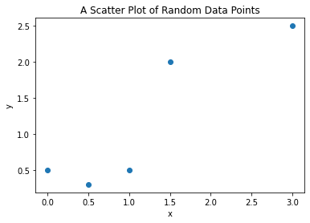
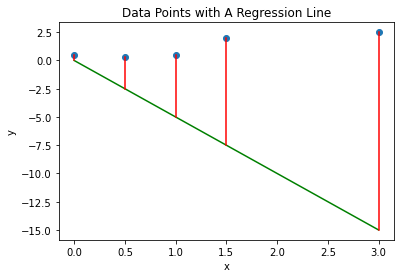
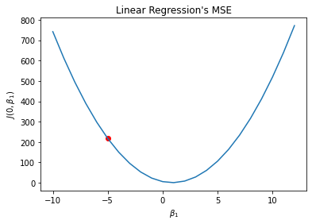
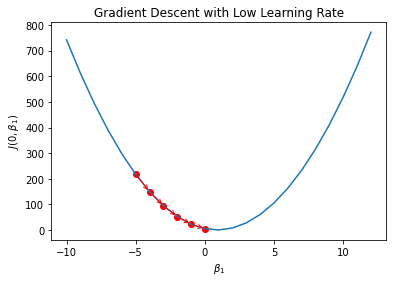
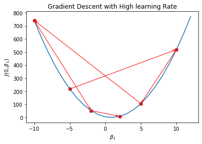

import { Link } from 'gatsby'

This is part 1 of the series on Gradient Descent.

- <Link to="/blog/part-2-gradient-descent">
    Part 2: Gradient Descent
  </Link>
- <Link to="/blog/part-3-batch-gradient-descent">
    Part 3: Batch Gradient Descent
  </Link>
- <Link to="/blog/part-4-stochastic-gradient-descent">
    Part 4: Stochastic Gradient Descent
  </Link>

# Introduction

Remember in <Link to="/blog/linear-regression">the Linear Regression post</Link>, I mentioned that we can use gradient descent to descrease the MSE of a Linear Regression model.
Let's see how it works at a glance. 

Assume we have random data points like in the following graph.

We then make a regression line based on the following equation.

$$
    y = \beta_0 + \beta_1 x
$$

At this point, we want to find the best value for $\beta_0$ and $\beta_1$.
Assuming that we can't come up with the best answer, we can just randomly assign some random numbers to them.
Now, let's set $\beta_0 = 0$ and $\beta_1 = -5$, and we are going to get a regression line in the following graph.

The problem is that we can't simply guess random numbers and plug them in to $\beta_0$ and $\beta_1$ over and over again.
Clearly, we need a way to automate this.

Let's make a 2D graph showing the MSE graph where $\beta_0 = 0$ and $-10 \leq \beta_1 \leq 13$.

In the graph above, when $\beta_0 = 0$ and $\beta_1 = -5$, the MSE value is $217.42$ shown as a red dot.

I intentionally make the range wider to show everyone that the cost function (MSE) looks like an exponential function.
It's not easy to tell where the minimum point is at this moment, but it could be around $-3 \leq \beta_1 \leq 3$. 
Therefore, we are not going to guess the suitable value $\beta_1$ one by one.

The ideal scenario is that we can have the red dot going down the valley slowly by itself.

However, we don't want the red dot to bounce here and there. 
If so, it means that the learning rate is too high.
Don't worry if you are not sure what learning rate is since I have <Link to="/blog/what-is-the-best-learning-rate">a seperate post</Link> explaning what it is.

In the next section, we are going to discuss how we can help our little friend The Little Red Dot going down the valley.
Brace yourself because it is about to go down. I swear, no pun intended.

# Mathematics of Gradient Descent

Since we want to minimize the MSE value of the Linear Regression model, we want to find the best value for $\beta_0$ and $\beta_0$ so that the regression line that is located as close to most data points as possible. 

Let's express everything we want do in mathematical expressions.

The cost function
$$
    J(\beta_0, \beta_1) = \frac{1}{N} \sum_{i=1}^N (f(x) - y_i)^2
$$

The objective function
$$
    \min_{\beta_0, \beta_1} J(\beta_0, \beta_1)
$$

The update rules
$$
    \Theta_{i} = \beta_i - \alpha \cdot \frac{\partial}{\partial \beta_i} J(\beta_0, \beta_1)
$$

where $\beta_i$ is the coefficients we want to update and $\alpha$ is the learning rate.

Bear with me! This is going to involve a lot of Maths, especially Calculus.

Let's simplify the partial derivation in the equation above

$$
    \begin{aligned}
        \frac{\partial}{\partial \beta_i} J(\beta_0, \beta_1) 
        &= \frac{\partial}{\partial \beta_i} (\frac{1}{N} \sum_{i=1}^N (f(x) - y_i)^2) \\
        &= \frac{1}{N} \frac{\partial}{\partial \beta_i} \sum_{i=1}^N (f(x) - y_i)^2
    \end{aligned}
$$

Solving the equality above with Power Rule, we then have
$$
    \frac{\partial}{\partial \beta_i} J(\beta_0, \beta_1) = \frac{2}{N} \sum_{i=1}^N (f(x) - y_i) \frac{\partial}{\partial \beta_i} (f(x) - y_i) 
$$

Since we want to update the $\beta_0$ and $\beta_1$ coefficients, we need to find the partial derivative of the cost function with respect to those coefficients.

$$
    \begin{aligned}
        \frac{\partial}{\partial \beta_0} J(\beta_0, \beta_1) 
        &= \frac{2}{N} \sum_{i=1}^N (f(x) - y_i) \frac{\partial}{\partial \beta_0} (\beta_0 + \beta_1 x - y_i) \\
        &= \frac{2}{N} \sum_{i=1}^N (f(x) - y_i)
    \end{aligned}
$$

$$
    \frac{\partial}{\partial \beta_1} J(\beta_0, \beta_1) = \frac{2}{N} \sum_{i=1}^N (f(x) - y_i) x
$$

We can also remove the $2$ from the two equations above by multiplying the cost function, in this case the MSE equation, by $\frac{1}{2}$.
Multiplying the cost function with a scalar will not affect its minimum value.

This new modified cost function is called **One Half Mean Squared Error**.

$$
    J(\beta_0, \beta_1) = \frac{1}{2N} \sum_{i=1}^N (\hat{y}_i - y_i)^2
$$

Since the $2$ is removed, 

$$
    \begin{aligned}
        \frac{\partial}{\partial \beta_0} J(\beta_0, \beta_1) = \frac{1}{N} \sum_{i=1}^N (f(x) - y_i) \\
        \frac{\partial}{\partial \beta_1} J(\beta_0, \beta_1) = \frac{1}{N} \sum_{i=1}^N (f(x) - y_i) x 
    \end{aligned}
$$

Pluggin each of the equation above into the update rule with respect to those coefficients, we get
$$
    \begin{aligned}
        \beta_0 = \beta_0 - \alpha \cdot \frac{1}{N} \sum_{i=1}^N (f(x) - y_i) \\
        \beta_1 = \beta_1 - \alpha \cdot \frac{1}{N} \sum_{i=1}^N (f(x) - y_i) x 
    \end{aligned}
$$

The two equations above will help us to approximate the minimum value of the cost function by updating $\beta_0$ and $\beta_1$ over time.

# References