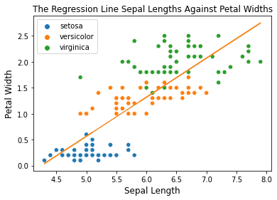
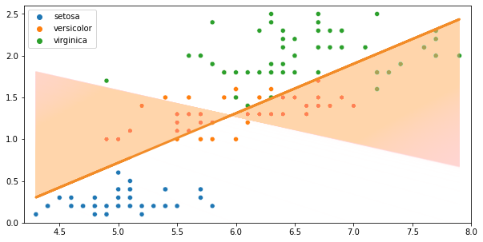

import { Link } from 'gatsby'

This is part 2 of the series on Gradient Descent.

- <Link to="/blog/part-1-mathematics-of-gradient-descent">
    Part 1: Mathematics of Gradient Descent
  </Link>
- <Link to="/blog/part-3-mini-batch-gradient-descent">
    Part 3: Mini-Batch Gradient Descent
  </Link>
- <Link to="/blog/part-4-stochastic-gradient-descent">
    Part 4: Stochastic Gradient Descent
  </Link>

Before we implement Gradient Descent in Python, we need to set a baseline to compare against our own implementation.
So, we are going to train our dataset into the Linear Regression built-in function made by `scikit-learn`

# Setting Up The Dataset

In this example, we are going to include the [Iris Dataset](https://archive.ics.uci.edu/ml/datasets/iris) from UCI Machine Learning Repository imported from `scikit-learn`.
There are two features in the dataset that we are going to analyse, namely `sepal_length` and `petal_width` shown in line 7 and 8.

```python {7-8, numberLines}
from sklearn.datasets import load_iris

iris = load_iris()
features = iris.data
target = iris.target

sepal_length = np.array(features[:, 0])
petal_width = np.array(features[:, 3])

species_names = list()

for i in target:
    if i == 0:
    species_names.append('setosa')
    elif i == 1:
    species_names.append('versicolor')
    else:
    species_names.append('virginica')
```

First, let's fit our dataset to `python:LinearRegression()` model that we imported from `python:sklearn.linear_model`.
```python
linreg = LinearRegression()

linreg.fit(
    X = sepal_length.reshape(-1,1),
    y = petal_width.reshape(-1,1)
)

print("Intercept: ",linreg.intercept_[0])
# Intercept: -3.200215 
print("First coefficient:", linreg.coef_[0][0])
# First coeficient: 0.75291757
```

Once we have the intercept and the coefficient values, let's make a regression line to see if the line is close to most data points.

```python
sns.scatterplot(
    x = sepal_length,
    y = petal_width,
    hue = species_names
)

plt.plot(
    sepal_length,
    linreg.intercept_[0] +
    linreg.coef_[0][0] * features[:, 0],
    color='red'
)
```

Clearly, the line is indeed very close to the most data points and we want to see the MSE of this regression line.

```python
linreg_predictions = linreg.predict(sepal_length.reshape(-1,1))
linreg_mse = mean_squared_error(linreg_predictions, petal_width)
print(f"The MSE is {linreg_mse}")
# The MSE is 0.19101500769427357
```

From the result we got from `python:sklearn`, the best regression line is

$$
    y = -3.200215 + 0.75291757 \cdot x
$$

The equation above is going to be our base line for this experiment to determine how good our own Gradient Descent implementation.



# Implementing Gradient Descent

Remember that in the first part of this series, we have customized the cost function, which is the MSE, simply by multiplying it by $\frac{1}{2}$ and named it **One Half Mean Squared Error**.
$$
    J(\Theta_0, \Theta_1) = \frac{1}{2N} \sum_{i=1}^N (\hat{y}_i - y_i)^2
$$

We have also acquired two equations that are reponsible for updating $\beta_0$ and $\beta_1$. Namely,
$$
    \begin{aligned}
        \beta_0 = \beta_0 - \frac{\alpha}{N} \sum_{i=1}^N (f(x) - y_i) \\
        \beta_1 = \beta_1 - \frac{\alpha}{N} \sum_{i=1}^N (f(x) - y_i) x 
    \end{aligned}
$$

Now, let's translate these three equations into Python code.

```python {7-11}
def gd(x, y, epochs, df, alpha = 0.01):
    length = len(x)
    intercept, coefficient = 0.0, 0.0
    for epoch in range(epochs):
        sum_error = 0.0
        predictions = predict(intercept, coefficient, x)
        b0 = (1/length) * np.sum(predictions - y)
        b1 = (1/length) * np.sum((predictions - y) * x)
        intercept = intercept - alpha * b0
        coefficient = coefficient - alpha * b1
        cost_function = sum_error + np.sum((predictions - y) ** 2) / (2 * length)
        df.loc[epoch] = [intercept, coefficient, cost_function]
    return df
```

Then we create a dataframe to store the result at each iteration and run the `python:gd()` function for over 10,000 times.

```python
gd_loss = pd.DataFrame(columns=['intercept', 'coefficient', 'sum_error'])
gd_loss = gd(sepal_length, petal_width, epochs = 10_000, df = gd_loss)
```

Below is the figure of the regression lines tend to look like at the 1,000th, the 5,000th, and the 10,000th iterations.


So let's see the MSE values at the 1000th, the 5000th, and the 1000th iterations.


After 10,000 iterations, the MSE value of our own Gradient Descent is $0.19557315833450503$ which is quite close to our baseline, which is `0.19101500769427357`.

Combining everything, here is how the regression line changes over time.



Let's animate the movement of the regression lines.


I am not including most of the codes in this blog post. So if you want to know how those graphs were generated, [click here](https://www.kaggle.com/bijonsetyawan/part-1-gradient-descent) to check the Python notebook on Kaggle.

# Conclusion

Here are some keypoints for Batch Gradient Descent.

1. 


# References
1. M. Jack. _3D Gradient Descent in Python_. Source [https://jackmckew.dev/3d-gradient-descent-in-python.html](https://jackmckew.dev/3d-gradient-descent-in-python.html)
2. T. Arseny. _Gradient Descent From Scratch_. Source [https://towardsdatascience.com/gradient-descent-from-scratch-e8b75fa986cc](https://towardsdatascience.com/gradient-descent-from-scratch-e8b75fa986cc)