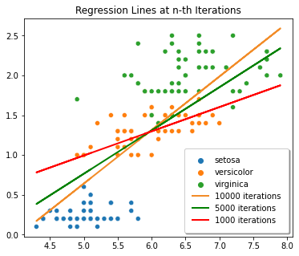
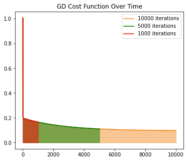
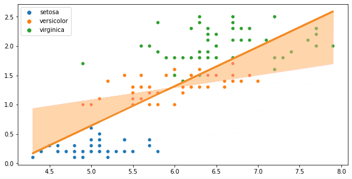
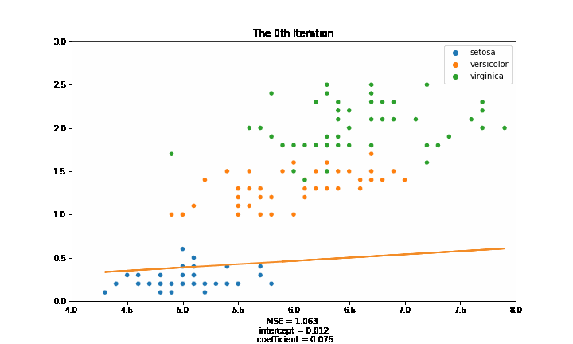

import { Link } from 'gatsby';

This is part 2 of the series on Gradient Descent.

- <Link to="/blog/part-1-mathematics-of-gradient-descent">
    Part 1: Mathematics of Gradient Descent
  </Link>
- <Link to="/blog/part-3-batch-gradient-descent">
    Part 3: Batch Gradient Descent
  </Link>
- <Link to="/blog/part-4-stochastic-gradient-descent">
    Part 4: Stochastic Gradient Descent
  </Link>

Remember that in the first part of this series, we have customized our cost function. Namely,
$$
    J(\Theta_0, \Theta_1) = \frac{1}{2N} \sum_{i=1}^N (\hat{y}_i - y_i)^2
$$

We have also acquired two equations that are reponsible for updating $b_0$ and $b_1$. Namely,
$$
    \begin{aligned}
        \Theta_{0} = \Theta_0 - \alpha \cdot \frac{1}{N} \sum_{i=1}^N (f(x) - y_i) \\
        \Theta_{1} = \Theta_1 - \alpha \cdot \frac{1}{N} \sum_{i=1}^N (f(x) - y_i) x 
    \end{aligned}
$$

Now, let's translate these three equations into Python code.

# implementation of Gradient Descent

Before we start with the implemetations, we should first import the iris dataset from `sklearn`.

```python
from sklearn.datasets import load_iris

iris = load_iris()
features = iris.data
target = iris.target

sepal_length = np.array(features[:, 0])
petal_width = np.array(features[:, 3])

species_names = list()

for i in target:
    if i == 0:
    species_names.append('setosa')
    elif i == 1:
    species_names.append('versicolor')
    else:
    species_names.append('virginica')
```

First, let's fit our dataset to `python:LinearRegression()` model that we imported from `python:sklearn.linear_model`.

```python
linreg = LinearRegression()

linreg.fit(
    X = sepal_length.reshape(-1,1),
    y = petal_width.reshape(-1,1)
)

sns.scatterplot(
    x = sepal_length,
    y = petal_width,
    hue = species_names
)

plt.plot(
    sepal_length,
    linreg.intercept_[0] +
    linreg.coef_[0][0] * features[:, 0],
    color='red'
)
```

Let's see the intercept and the coefficient that `python:LinearRegression()` produced from our dataset.
We are also want to see how much the MSE is, so let's print that as well.

```python
print(linreg.intercept_, linreg.coefficient_)
# [-3.200215] [[0.75291757]]

linreg_predictions = linreg.predict(sepal_length.reshape(-1,1))
linreg_mse = mean_squared_error(linreg_predictions, petal_width)
print(f"Linear Regression's MSE is {linreg_mse}")
# Linear Regression's MSE is 0.19101500769427357
```

From the result we got from `python:sklearn`, the best regression line is

$$
    y = -3.200215 + 0.75291757 \cdot x
$$

which most data points are located near it.


Since most data points are near the regression line, the MSE tends to be low which is $0.19101500769427357$.
So if most data points are far from the regression line, the MSE tends to be high.

We're going to use that MSE, and compare it to our own MSE from the Gradient Descent algorithm.

# Gradient Descent

$$
    \Theta_{i} = \Theta_i - \frac{\alpha}{N} \sum^{N}_{i=1} (\hat{y}_i - y_i) \cdot x_i
$$

The equation above is what helps us to minimize the intercept and the first coefficient.
Let's denote the intercept $b_0$ and the first coefficient $b_1$.
Since we have two weights that we have to update over time, let's change $\Theta_i$ to the variables we intend to use.
In this case, they are $b_0$ and $b_1$.

$$
    b_0 = b_0 - \frac{\alpha}{N} \sum^{N}_{i=1} (\hat{y}_i - y_i)
$$

and to update the first coefficient

$$
    b_1 = b_1 - \frac{\alpha}{N} \sum^{N}_{i=1} (\hat{y}_i - y_i) \cdot x_i
$$

Converting those two equations above to python code, we then have

```python {7-10}
def gd(x, y, epochs, df, alpha = 0.01):
    length = len(x)
    intercept, coefficient = 0.0, 0.0
    for epoch in range(epochs):
        sum_error = 0.0
        predictions = predict(intercept, coefficient, x)
        b0 = (1/length) * np.sum(predictions - y)
        b1 = (1/length) * np.sum((predictions - y) * x)
        intercept = intercept - alpha * b0
        coefficient = coefficient - alpha * b1
        sum_error = sum_error + np.sum((predictions - y) ** 2) / (2 * length)
        df.loc[epoch] = [intercept, coefficient, sum_error]
    return df
```

Then we create a dataframe to store the result and run the `python:gd()` function for over 10,000 times.

```python
gd_loss = pd.DataFrame(columns=['intercept', 'coefficient', 'sum_error'])
gd_loss = gd(sepal_length, petal_width, epochs = 10000, df = gd_loss)
```

Below is the figure of the regression lines tend to look like at the 1,000th, the 5,000th, and the 10,000th iterations.



So let's see the MSE values at the 1000th, the 5000th, and the 1000th iterations.



After 10000 iterations, our GD's MSE, `0.19557315833450503`, is quite close to Scikit-Learn's Linear Regression's MSE which is `0.19101500769427357`.

Combining everything, here is how the regression line changes over time.



Let's animate the movement of the regression lines.



I am not including most of the codes in this blog post. So if you want to know how those graphs were generated, [click here](https://www.kaggle.com/bijonsetyawan/part-1-gradient-descent) to check the Python notebook on Kaggle.