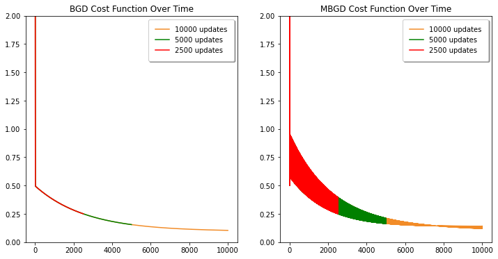
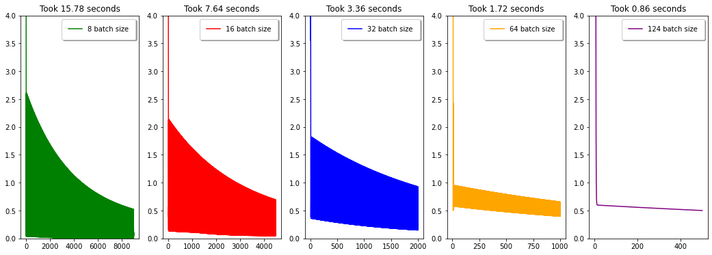
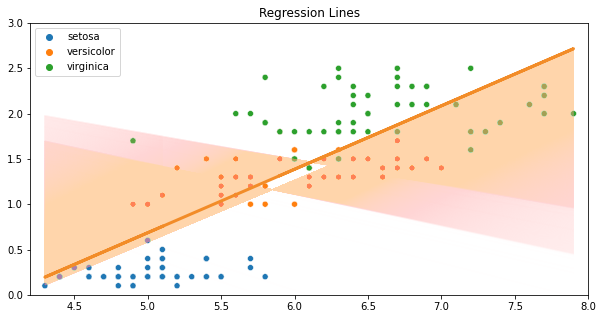
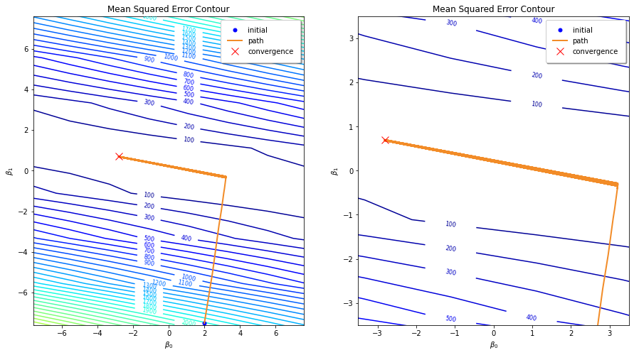

import { Link } from 'gatsby';

This is part 3 of the series on Gradient Descent.

- <Link to="/blog/part-1-mathematics-of-gradient-descent">
    Part 1: Mathematics of Gradient Descent
  </Link>
- <Link to="/blog/part-2-batch-gradient-descent">
    Part 2: Batch Gradient Descent
  </Link>
- <Link to="/blog/part-4-stochastic-gradient-descent">
    Part 4: Stochastic Gradient Descent
  </Link>

Previously, we have learned that Batch Gradient Descent only updates the parameters only after it has seen the entire dataset.
However, in this post, we are going to implement Mini-Batch Gradient Descent which updates the parameters after it has seen a fraction of a dataset.
Not only that, but we are also going to find out the best batch size to make the algorithm converge faster.

# Implementation

In this implementation, we are going to use some of the codes from the previous posts. 
However, we are going to customize Batch Gradient Descent function
so the parameters are updated after it has seen a fraction of the dataset.

First, we need a function that splits the dataset into mini-batches.

```python
def create_batches(x, y, batch_size):
    x_batches = np.array_split(x, len(x) // batch_size)
    y_batches = np.array_split(y, len(y) // batch_size)
    return x_batches, y_batches
```

Second, we need a customized version of Batch Gradient Descent function that updates the required parameters after seeing a small number of data points.
Since there are $150$ data points in the Iris dataset, we will use a batch size of $64$ and there will be two batches in total.

```python
the following code is the customized `bgd()` function that updates the parameters after it has seen a fraction of the dataset.

```python {12-21}
def mbgd(x, y, epochs, df, batch_size = 64, alpha = 0.01):
    intercept, coefficient = 2.0, -7.5

    # first sum_error
    predictions = predict(intercept, coefficient, x)
    sum_error = np.sum((predictions - y) ** 2) / (2 * batch_size)
    df.loc[0] = [-1, intercept, coefficient, sum_error]
    index = 1

    x_batches, y_batches = create_batches(x, y, batch_size)
    for epoch in range(epochs):
        for x, y in zip(x_batches, y_batches):
            sum_error = 0.0
            predictions = predict(intercept, coefficient, x)
            b0_error = (1/batch_size) * np.sum(predictions - y)
            b1_error = (1/batch_size) * np.sum((predictions - y) * x)
            intercept = intercept - alpha * b0_error
            coefficient = coefficient - alpha * b1_error 
            sum_error = sum_error + np.sum((predictions - y) ** 2) / (2 * batch_size)
            df.loc[index] = [int(epoch), intercept, coefficient, sum_error]
            index += 1
    return df
```

First, the initial point is set to be $(2.0, -7.5)$ because I want our initial guess to be far from the convergence point.

After that, the batches will be created just before the `for-loop` started. The parameter updates will happen in the `for-loop` over time.

# Cost Function

In the previous section, I just explained on how to implement MBGD in Python.
Now, let's find out what we can get from this experimentation.

```python
epochs = 5000
mbgd_loss = pd.DataFrame(columns=['epoch', 'intercept', 'coefficient', 'sum_error'])
mbgd_loss = mbgd(sepal_length, petal_width, epochs = epochs, batch_size=64, df = mbgd_loss)
mbgd_loss['epoch'] = mbgd_loss['epoch'].astype(int)
```

Althought the size of the batches matters in Mini Batch Gradient descent, we will stick to size $64$ this time.



From the picture, we can see that the MSE line produced by MBGD is thicker because the values goes up and down, following a zig-zag pattern,
unlike the one produced by `bgd()` which goes down in a straight line.

Even though Mini Batch Gradient Descent was done in $5000$ iterations, the number of parameter updates happened in MBGD is the same with one in BGD.
You should know that there are two batches for the Iris dataset since the dataset contains $150$ data points. 
Therefore there will be two parameter updates in each iteration, and the number of parameter updates in BGD and MBGD are the same.

# Best Batch Size

Here we are going to do a little experiment to see how MBGD reacts to the number data points in each batch. 

First, we are going to iteratively train MBGD with different batch sizes.

There are 4 batch sizes that I want to try, namely $8$, $16$, $32$, and $64$.



As you can see that, as the number of batch sizes increases, the time complexity reduces by half and the cost function becomes thinner and thinner.

To answer what is the best batch size, it depends a lot on the hardware you have.
Let's say you have multiple latest and advanced GPUs, then you can try to use $32$ or $64$ as the best batch size.

Not only it depends only the hardware you have, you should consider how your model reacts to the number of batch sizes. 
So, there is no clear answer to this question. I personally think it's all down to trial and error.

# Regression Lines

There will be two graphs, one contains how the regression line movement pattern over $n$ number of updates, and the other is the animation of the regression line movements.



I am sure since the cost function follows a zig-zag pattern, the regression line moves in a zig-zag pattern as well like a graph shown above.


However, it's not noticeable the pattern movement in the animation. If somebody can explain me in details on why this is happening, do not hesitate to send me an email.

Now, let's see how the cost function looks like in a contour map.



In the right figure above, the zoomed in one in particular, the line looks like is walking up the stairs. 

# Conclusion

There are several key points to be noted in this post.
1. MBGD requires less iterations to reach the convergence point compared to BGD.
2. The number of parameter updates in MBGD is the same with BGD, except the size of mini batches.
3. The size of mini batches might affect MBGD's efficiency.
4. The closer the batch size is to the number of data points, the thinner the cost function line gets.
5. The MSE line produced by MBGD follows a zig-zag pattern, and that's why it looks thicker.
6. The ideal batch size is around $32$ or $64$ depending on the hardware you have.

If you want to know how to implement MBGD in more details, please [click here](https://www.kaggle.com/bijonsetyawan/mini-batch-gradient-descent) to check the Python notebook on Kaggle.
I also include some code on how to generate those graphs.

The code might look unorganized since I have been busy with my thesis, so the code might change from time to time.
See ya at the next post!

# References

1. O. Artem. _Stochastic, Batch, and Mini-Batch Gradient Descent_. Source [https://towardsdatascience.com/stochastic-batch-and-mini-batch-gradient-descent-demystified-8b28978f7f5](https://towardsdatascience.com/stochastic-batch-and-mini-batch-gradient-descent-demystified-8b28978f7f5)
2. P. Sushant. _Batch, Mini Batch, and Stochastic Gradient Descent_. Source [https://towardsdatascience.com/batch-mini-batch-stochastic-gradient-descent-7a62ecba642a](https://towardsdatascience.com/batch-mini-batch-stochastic-gradient-descent-7a62ecba642a)
3. Geeksforgeeks. _Difference between Batch Gradient Descent and Stochastic Gradient Descent_. Source [https://www.geeksforgeeks.org/difference-between-batch-gradient-descent-and-stochastic-gradient-descent/](https://www.geeksforgeeks.org/difference-between-batch-gradient-descent-and-stochastic-gradient-descent/)
4. Sweta. _Batch, Mini Batch, and Stochastic Gradient Descent_. Source [https://sweta-nit.medium.com/batch-mini-batch-and-stochastic-gradient-descent-e9bc4cacd461](https://sweta-nit.medium.com/batch-mini-batch-and-stochastic-gradient-descent-e9bc4cacd461)
5. B. Jason. _A Gentle Introduction to Mini-Batch Gradient Descent and How to Configure Batch Size_. Source [https://machinelearningmastery.com/gentle-introduction-mini-batch-gradient-descent-configure-batch-size/](https://machinelearningmastery.com/gentle-introduction-mini-batch-gradient-descent-configure-batch-size/)
6. Geeksforgeeks. _ML | Mini-Batch Gradient Descent with Python_. Source [https://www.geeksforgeeks.org/ml-mini-batch-gradient-descent-with-python/](https://www.geeksforgeeks.org/ml-mini-batch-gradient-descent-with-python/)

How to decide the best batch size source [https://stackoverflow.com/questions/46654424/how-to-calculate-optimal-batch-size](https://stackoverflow.com/questions/46654424/how-to-calculate-optimal-batch-size)
[https://ai.stackexchange.com/questions/8560/how-do-i-choose-the-optimal-batch-size](https://ai.stackexchange.com/questions/8560/how-do-i-choose-the-optimal-batch-size)