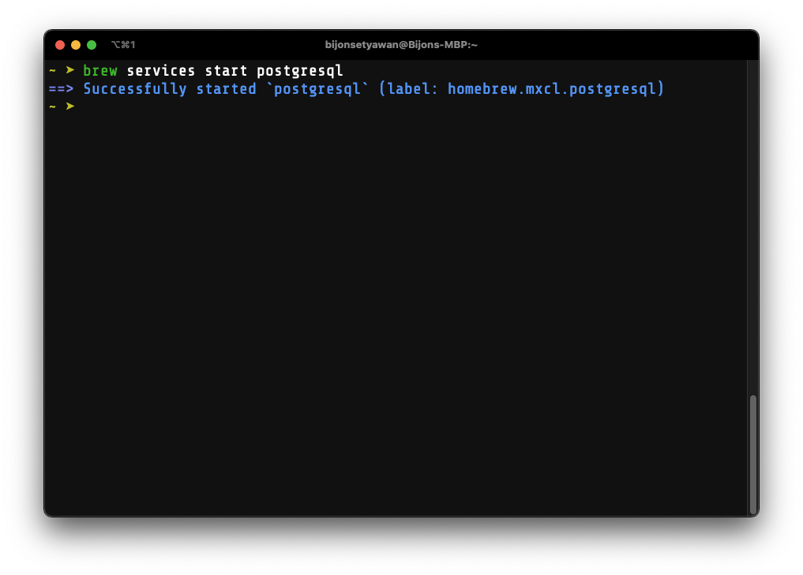

In this post, we are going to learn a few things:

1. How to install SQL frameworks
2. How to create and delete user, as well as to assign privileges to a user
3. How to create a database with a PostgreSQL script
4. How to show all tables in a database
5. How to access a PostgreSQL database with Python
6. How to convert tables into CSV files
7. How to convert CSV files into SQLite3 DB files

<i>
  *NOTE: Some of the commands are unique to MacOS. Please find out what commands
  to run specific to your operating system.
</i>

# 1. Installation

First, we have to install the SQL server that you intend to use. Choose one.

```bash:title=Terminal
# To install PostgreSQL
brew install postgresql

# To install SQLite3
pip install --user sqlite3
```

To see if we have installed any of them properly, simply run

```bash:title=Terminal
postgresql --version # postgres (PostgreSQL) 13.4

sqlite3 --version # 3.32.3 ...
```

If you have sqlite3 installed, just skip the second and the third steps since it doesn't need any servers and data in a table can be saved into `bash:.db` file.
Once we have postgresql installed, let's ramp up the postgresql server and access it via a user called `bash:postgres`. 
Simply run,

```bash:title=Terminal
brew services start postgresql
psql postgres
```



If you arent's sure that the postgresql server has not been ramped up, simply run

```bash:title=Terminal
brew services
```


# 2. Create & Delete Users

Once the server is up, run `bash:psql postgres` and it will redirect us to the postgresql interactive shell
Let's create a new superuser that allows us to create any databases on the server.

```sql:title=plsq-shell
CREATE USER a_user WITH SUPERUSER LOGIN;
ALTER ROLE a_user WITH CREATEDB;
```


`sql:LOGIN` should be specified. Otherwise, the server will reject the logging in request.
Then run `sql:\du` in the shell to see if `sql:a_user` has been successfully created.

Assigning a privilege to a user is also important.
In this case, we want `sql:a_user` to be able to create a database.
Thus we're adding a new privilege to it with `sql:ALTER ROLE a_user WITH CREATEDB;`.


If you accidentally create a user you don't indent to, simply run `sql:DROP ROLE {username};` in the PostgreSQL interactive shell.

# 3. Running AN SQL Script

Below is a script that allows us to create IMDB film database automatically.
The script can be downloaded <a itemProp="url" itemType="http://schema.org/Url" href="https://drive.google.com/file/d/1wKMPcbj9jr3twYBUNwtz1xxayWkAaUwu/view?usp=sharing" target="\_blank" rel="nofollow noopener noreferrer">here</a>.
After running this script, we will expect 4 tables which are `sql:films`, `sql:people`, `sql:reviews`, and `sql:roles`.

```sql:title=script.sql
--
-- PostgreSQL database dump
--

-- Dumped from database version 9.6.3
-- Dumped by pg_dump version 9.6.3

SET statement_timeout = 0;
SET lock_timeout = 0;
SET idle_in_transaction_session_timeout = 0;
SET client_encoding = 'UTF8';
SET standard_conforming_strings = on;
SET check_function_bodies = false;
SET client_min_messages = warning;
SET row_security = off;
...
```

To run the script, simply run

```bash:title=Terminal
psql a_user -h localhost -d film_db -f films.sql
```

If you aren't sure what `bash:-h`, `bash:d`, and `bash:-f` mean, you can simply run `bash:psql --help`.

The command above, with the `sql:a_user` user account, execute and store the tables described in the script into a database called `sql:film_db`.

After running the script, go back to the PostgreSQL interactive shell and access the film database using `sql:a_user`.

```bash:title=Terminal
psql a_user -d film_db
```

To verify if the tables were created successfully, simply run `sql:\dt` in the shell then you'll see the following result.

```sql
            List of relations
 Schema |  Name   | Type  |     Owner
--------+---------+-------+---------------
 public | films   | table | a_user
 public | people  | table | a_user
 public | reviews | table | a_user
 public | roles   | table | a_user
 (4 rows)
```

# 4. Accessing A Database With Python

Since we have PostgreSQL installed and a database in the server, we need to install `bash:psycopg2` by running `bash:pip install --user psycopg2`.

```python:title=database.py
import psycopg2

connection = psycopg2.connect(
  host='localhost',
  database='film_db',
  user='a_user'
)
cursor = connection.cursor()
```

Once we have a connection to the server, we want to see what tables are available in the `film_db` database.

```python:title=database.py
cursor.execute("""
  SELECT table_name FROM information_schema.tables
  WHERE table_schema = 'public'
""")

tables = [] # to store the name of each table in the database for future use
for table in cursor.fetchall():
    print(table[0])
    tables.append(table[0])
```

To show every row and every column of the data in `sql:film` table, simply run

```python:title=database.py
cursor.execute("SELECT * FROM films;")
print(cursor.fetchall())
```

Say that we want to convert all the tables in the database into CSV files, add the following block of code to do so in the python script.

```python:title=database.py
for table in tables:
    sql = f"COPY (SELECT * FROM {table}) TO STDOUT WITH CSV HEADER DELIMITER ','"
    with open(f"./{table}.csv", "w") as file:
        cursor.copy_expert(sql, file, size=8192)
```

Now we have 4 different CSV files.
Here is the downside of CSV files: when the number of data in the CSV file increases, the computing resource to read the file also increases.
There are some work around to avoid resource overconsumption by storing the data into Pickle files.
However, storing millions of data in `bash:.db` file can be another work around as well.

# 5. Converting CSV files into SQLite DB files

With SQLite3, we don't need to create any users since it doesn't need any server to run at all.
Since we have all the CSV files that we need, we have to feed the data into `bash:.db` files.

```python:title=sqlite.py
import sqlite3
import pandas as pd
tables = ["films", "people", "review", "roles"]

for table in tables:
    connection = sqlite3.connect(table+'.db')
    dataframe = pd.read_csv(table+'.csv')
    dataframe.to_sql(table, connection, if_exists='append', index = True)
```

Then we can see that four new `bash:.db` files have been created. To make sure that these `bash:.db` files are legit, simply run

```python:title=sqlite.py
connection = sqlite3.connect('films.db')
cursor = connection.cursor()
cursor.execute("SELECT * FROM films;")
print(cursor.fetchall())
```

Do the same with the other db files. You just simply need to change `sql:films` into another table's name.

That's it. We just learned 7 things that I mentioned in the beginning of the post. Hope you enjoy it.
