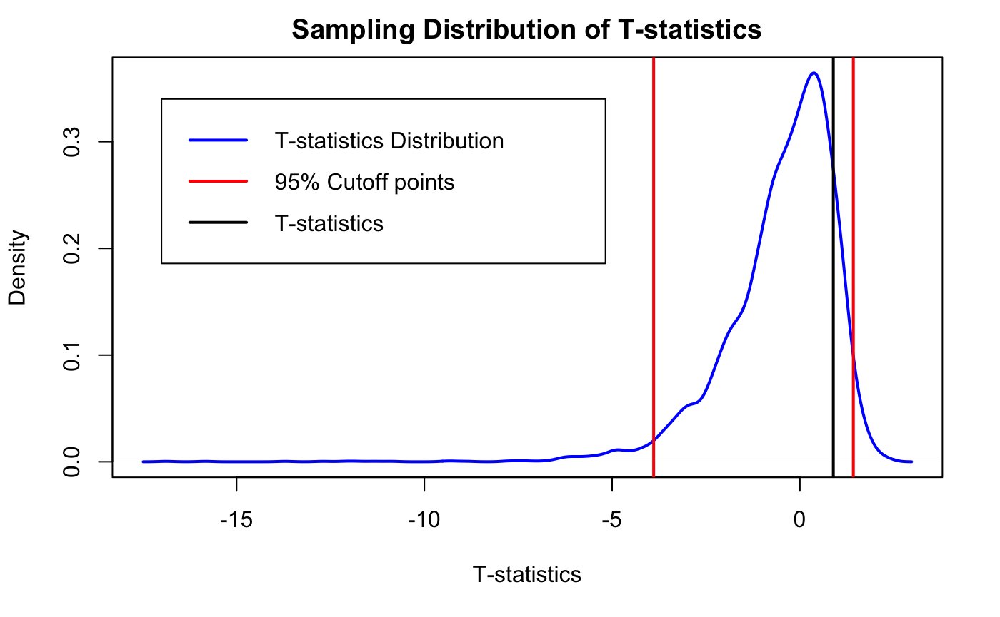
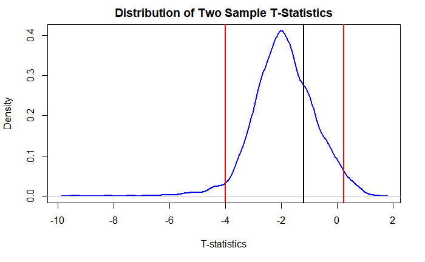

There are many hypothesis testing methods exist in the realm of Statistics.
However, each only suitable for certain conditions.
To make things simple, I am only going to discuss the difference between T-Test and Z-Test.

Before we jump into the definitions of those two, we should know the definition of hypothesis testing.
Hypothesis testing is a way to verify our hypothesis on a population or multiple populations.
The core idea of hypothesis testing is to see if our experiment is repeatable and testable with scientific techniques, not merely an experiment with an extreme result that is acquired by chance.
Experiments with extreme results are not useful for anyone since they are not predictable.

Let's say a transportation company claimed that the average waiting time for someone to get on a bus is 1 minute.
However, we are not sure that whether it's true as if it's too good to be true.
As result, we want to see that if the average waiting time is 1 minute in reality.
First, we have to define the null hypothesis and the alternative hypothesis.
In this case, the null hypothesis is _the average waiting time is 1 minute_, and the two sided alternative hypothesis is _the average waiting time is not 1 minute_.

There is still another problem, how do we know when to accept or reject the null hypothesis?
We then need _alpha value_ denoted as $\alpha$. 
_Alpha value_ is the acceptable amount of _type I error_, and it should be determined even before this experiment starts.
The most common _alpha value_ is $0.05$.

Before we go deeper, we should know what _type I error_ and _type II error_ are.
Type I error is when a true null hypothesis being rejected.
While type II error is when a false null hypothesis being accepted.

From the T-statistics we calculate from a small random samples, we then verify if the T-statistics falls within the 95% Confidence Interval.
We can also calculate P-value from T-statistics.
If P-value is greater than the alpha value, we accept the null hypothesis and reject the alternative hypothesis. 
If P-value is equal or less than the alpha value, we reject the null hypothesis and accept the alternative hypothesis instead.

In the experiment shown in the example above, by default, we accept the null hypothesis.
After a hypothesis testing is done, then we have to decide whether to accept or reject the null hypothesis.

Most importantly, this tutorial will be done in R.
Before reading further, please install the dataset with `install.packages(resampledata)` in your R console.
It will install all the data sets used in a book called [Mathematical Statistics with Resampling and R](https://sites.google.com/site/chiharahesterberg/home), and we are going to use Verizon data set.

# 1. T-Test

T-Test is a hypothesis testing method that statisticians use when the standard deviation
is unknown, and the number of data points is small $(n < 30)$.

## 1.1 One-Sample T-Test

Here is the formula we need in order to do one-sample T-test

$$
t = \frac{\bar{X} - \mu}{s/\sqrt{n}}
$$

where,

1. $t$ is the t-statistics
2. $\bar{X}$ is the sample mean
3. $\mu$ is the hypothesized mean
4. $s$ is the sample's standard error
5. $n$ is the size of sample mean


First we define the _null hypothesis_,the _alternative hypothesis_, and the alpha value.
1. Null hypothesis is _"ILEC's average service time is 8.4 seconds"_
2. Alternative hypothesis is _"ILEC's average service time is not 8.4 seconds"_
3. Alpha value $\alpha = 0.05$

We then prepare the data set,

```r:title=load_dataset.r
library(resampledata) # load up Verizon dataset
ilec <- as.data.frame(Verizon[Verizon$Group == "ILEC", ])
mean(ilec$Time) # 8.4
```

We have ILEC's average service time to be $8.4$ seconds, and let's say we are skeptical whether if its true mean is really $8.4$ seconds.
Then we should do one sample T-test to see if that is the case. 

A few things to remember:
1. We are not sure if the true mean is indeed $8.4$
2. The predefined alpha value is $0.05$
2. The standard deviation is unknown
3. The number of random sample should be below 30, or 25 to be specific

Let's take 25 random samples from ILEC population, and calculate its T-statistics.

```r:title=manual_one_sample_ttest.r
set.seed(1998)
n_sample <- 25
sample <- sample(ilec$Time, n_sample, replace = TRUE)
sample_sderr <- sd(sample) / sqrt(n_sample)
one_sample_tstats <- (mean(sample) - mean(ilec$Time)) / sderr
one_sample_tstats # 0.8896381
```

After acquiring the T-statistics manually, we want to bootstrap the T-statistics for 5000 times.

```r:title=bootstrap_one_sample_ttest.r
set.seed(1999)
one_sample_ttest <- function(population) {
  sample <- sample(population, n_sample, replace = TRUE)
  sample_sderr <- sd(sample) / sqrt(n_sample)
  t_statistics <- (mean(sample) - mean(population)) / sample_sderr
  return(t_statistics)
}

bootstrapped_one_sample_ttest <- replicate(5000, one_sample_ttest(ilec$Time))

plot(
  lwd = 2,
  col = "blue",
  density(bootstrapped_one_sample_ttest),
  main = "Sampling Distribution of T-statistics",
  xlab = "T-statistics"
)
abline(v = quantile(bootstrapped_one_sample_ttest, probs = c(0.025, 0.975)), col = "red", lwd = 2)

abline(v = sample_t_statistics, lwd = 2)

legend(
  -17,
  0.34,
  col = c("blue", "red", "black"),
  lwd = c(2,2,2),
  c("T-statistics Distribution", "95% Cutoff points", "T-statistics")
)
```



The area between the red lines tell us that, "Any T-statistics value will fall within this area for 95% percent of the time."
That is why this area is called 95% Confidence Interval, and our `one_sample_tstats` value fall within this area.
We can safely assume that the 25 random samples that we pick in `one_sample_ttest.r` represent the entire population and its T-statistics fall within the specified area.

With `one_sample_tstats` value in `one_sample_ttest.r`, then we can calculate the P-value with degrees of freedom `n_sample - 1`.

```r:title=one_sample_ttest_pvalue.r
2 * pt(-abs(one_sample_tstats), df = n_sample - 1)
# 0.3824913
```

We then got the p-value of $0.3824913$.
Since the p-value is way greater than $\alpha = 0.05$, 
we can accept the null hypothesis and reject the alternative hypothesis.
I have mentioned that P-value is the probability of type I error.
Since p-value of $0.3824913$ is way higher than $\alpha = 0.05$, 
we can say that the probability of rejecting a true null hypothesis is high.
Since the percentage is high, we don't want to reject the null hypothesis.

Some people call this kind of discovery is _statistically insignificant_, meaning the probability of having a this kind result is relatively higher given the null hypothesis is true.

We can verify our discovery with `t.test()` function.

```r:title=one_liner_one_sample_ttest.r
t.test(random_sample, mu = 8.4, alternative = "two.sided", conf = 0.95)
# 	One Sample t-test
# data:  random_sample
# t = 0.89499, df = 24, p-value = 0.3797
# alternative hypothesis: true mean is not equal to 8.4
# 95 percent confidence interval:
#   5.862575 14.823025
# sample estimates:
# mean of x
#   10.3428
```

It seems like the p-value of `0.3824913` we calculated manually and the p-value of `0.3797` from `t.test()` function don't differ that much.
Thus, we can accept the null hypothesis and conclude that _ILEC's average repair time is indeed 8.4 seconds_.

## 1.2 Two-Sample T-Test

Let's say Verizon claimed that ILEC and CLEC's average repair time are the same, we then have to do two samples T-test since this test will involve two kind of different samples.

First we define the _null hypothesis_, the _alternative hypothesis_, and the alpha value.
1. Null hypothesis: _"ILEC and CLEC average repair time are the same"_
2. Alternative hypothesis: _"ILEC and CLEC average repair time are the same"_
3. Alpha value $\alpha = 0.05$

```r:title=calculate_two_groups_sd.r
sd(ilec$Time) # 14.69004
sd(clec$Time) # 19.50358
```

A few things to remember:
1. We are not sure if the true mean of ILEC and CLEC are the same
2. ILEC and CLEC's standard deviation values are different
3. The number of random sample for each group should be below 30, or 25 to be specific

Since the standard deviation between these two groups are different, we can't use pooled standard deviation, meaning a combined standard deviation.
Instead, we are going to use each group's standard error.

Here is the formula for calculating these two groups' t-statistics

$$
  t = \frac{\bar{x}_1 - \bar{x}_2}{\sqrt{\frac{s_1^2}{n_1} + \frac{s_2^2}{n_2}}}
$$

where, 
1. $\bar{x}_n$ is the mean of the n-th group
2. $s_n^2$ is the standard deviation of the n-th group
3. $n_n$ is the number of data points of the n-th group

```r:title=manual_two_sample_ttest.r
set.seed(2000)

n_length <- 25

ilec_sample <- sample(ilec$Time, n_length, replace = TRUE)
clec_sample <- sample(clec$Time, n_length, replace = TRUE)

ilec_sd <- sd(ilec_sample)
clec_sd <- sd(clec_sample)

mean_diff <- mean(ilec_sample) - mean(clec_sample)
sderr <- sqrt((ilec_sd^2 / n_length) + (clec_sd^2 / n_length))
two_sample_tstats <- mean_diff / sderr
two_sample_tstats # -1.199484
```

We then bootstrap the two-sample T-test

```r:title=bootstrap_two_sample_ttest.r
set.seed(2001)

n_length <- 25

two_sample_ttest <- function(population1, population2) {
  sample1 <- sample(population1, n_length, replace = TRUE)
  mean1 <- mean(sample1)
  sd1 <- sd(sample1)
  
  sample2 <- sample(population2, n_length, replace = TRUE)
  mean2 <- mean(sample2)
  sd2 <- sd(sample2)
  
  mean_diff <- mean1 - mean2
  sderr <- sqrt((sd1^2 / n_length) + (sd2^2 / n_length))
  t_stats <- mean_difference / sderr
  return(t_stats)
}

bootstrapped_two_sample_ttest <- replicate(5000, two_sample_ttest(ilec$Time, clec$Time))

plot(
  lwd = 2,
  col = "blue",
  density(bootstrapped_two_sample_ttest),
  main = "Distribution of Two Sample T-Statistics",
  xlab = "T-statistics"
)

abline(v = quantile(bootstrapped_two_sample_ttest, probs = c(0.025, 0.975)), col = "red", lwd = 2)
abline(v = two_sample_tstats, lwd = 2)
```



We can see that the t-statistics of the two group that we calculated manually fell within the 95% confidence interval.
Note that we are doing two tailed two-sample T-test.

Let's calculate their p-value to see if we want to accept or reject the null hypothesis.

```r:title=two-sample-ttest-pvalue.r
2 * pt(-abs(two_sample_tstats), df = n_length - 1)
# 0.2420483
```

Let's validate our observation above with `t.test()` function.
We have to set `mu = 0` since we want to verify if the two groups have the same true values.

```r:title=one_liner_two_sample_ttest.r
t.test(
  ilec_sample, 
  clec_sample, 
  alternative = "two.sided", 
  conf = 0.95
)
# 	Welch Two Sample t-test
# data:  ilec_sample and clec_sample
# t = -1.1995, df = 33.119, p-value = 0.2389
# alternative hypothesis: true difference in means is not equal to 0
# 95 percent confidence interval:
#    -14.101864   3.640264
# sample estimates:
# mean of x mean of y 
#    6.5176   11.7484 
```

It seems like the t-statistics and p-value that we manually calculated don't differ that much from the t-statistics and p-value from `t.test()` function.
Since the t-statistics fell within the 95% CI and the p-value is way greater than our predefine alpha value $\alpha = 0.05$, we should accept the null hypothesis.
Finally, we can conclude that _ILEC and CLEC average service time are about the same_.

# 2. Z-Test

Similar to T-test, however Z-Test is used when the standard deviation is known,
and the number of data points are big $(n \geq 30)$.

However, the one-sample and two sample Z-test formulas look almost the same like T-test's.

Here is the formula for one-sample Z-test,

$$
z = \frac{\bar{X} - \mu}{\sigma / \sqrt{n}}
$$

Where,

1. $z$ is the z-statistics
2. $\bar{X}$ is the sample mean
3. $\mu$ is the hypothesized mean
4. $\sigma$ is the population standard deviation value
5. $n$ is the size of sample mean

Here is the formula for two-sample Z-test,

$$
  t = \frac{\bar{x}_1 - \bar{x}_2}{\sqrt{\frac{s_1^2}{n_1} + \frac{s_2^2}{n_2}}}
$$

where, 
1. $\bar{x}_n$ is the mean of the n-th group
2. $s_n^2$ is the standard deviation of the n-th group
3. $n_n$ is the number of data points of the n-th group

Since we have familiarize ourselves with T-test, I am going to leave this part for you to tinker with.

# Key points

1. Hypothesis testing is a way to verify our hypothesis
2. A repeatable and testable experiment is useful and more significant for everyone
3. T-test is used when the standard deviation is unknown, and the number of data points is $(n < 30)$
4. Z-test is used when the standard deviation is known, and the number of data points are $(n \geq 30)$
5. Define the null hypothesis, the alternative hypothesis, and the alpha value way before the experiment starts
6. Widely accepted alpha value is $0.05$, and migth differ on different experiments
7. There are two ways of doing T-test and Z-test: one-sample and two-sample testings

# Reference
* [Hypothesis Testing](https://www.statisticshowto.com/probability-and-statistics/hypothesis-testing/)
* [Type I Error and Type II Error](https://en.wikipedia.org/wiki/Type_I_and_type_II_errors)
* [One Sample T-Test](https://www.jmp.com/en_us/statistics-knowledge-portal/t-test/one-sample-t-test.html)
* [Two Sample T-Test](https://www.jmp.com/en_us/statistics-knowledge-portal/t-test/two-sample-t-test.html)
* [Unpaired Two Sample T-Test](https://www.statsdirect.co.uk/help/parametric_methods/utt.htm)
* [T-Value Interpretations and Considerations](https://www.ncbi.nlm.nih.gov/pmc/articles/PMC5059270/)
