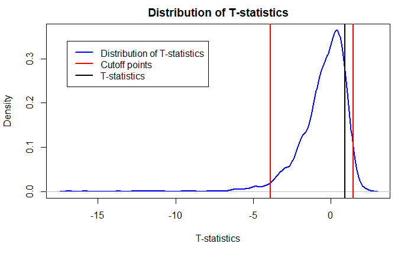

There are many hypothesis testing methods exist in the realm of statistics.
However, each only suitable for certain conditions.
To make things simple, I am only going to discuss the difference between T-Test and Z-Test.

Before we jump into the definitions of those two, we should know the definition of hypothesis testing.
Hypothesis testing is a way to verify our assumption on a population.

Let's say we wanted to verify if the average waiting time in a certain bus stop is 5 minutes,
and that's when a hypothesis testing is needed.
First, we define the null hypothesis and the alternative hypothesis.
In this case, the null hypothesis is <u>_the average waiting time is 5 minutes_</u>,
and the two sided alternative hypothesis is <u>_the average waiting time is not 5 minutes_</u>.

By default, we accept the null hypothesis.
After a hypothesis testing is done, and we have proven that the null hypothesis should be rejected, we then should accept the alternative hypothesis instead.

Note that there are two ways of hypothesis testing:

1. One sample hypothesis testing
2. Two samples hypothesis testing

Most importantly, this tutorial will be done in R.
Before reading further, please install the dataset with `install.packages(resampledata)` in your R console.
It will install all the data sets used in a book called [Mathematical Statistics with Resampling and R](https://sites.google.com/site/chiharahesterberg/home)

# 1. T-Test

T-Test is a hypothesis testing method that statisticians use when the standard deviation
is unknown, and the number of data points is small $(n < 30)$.

$$
t = \frac{\bar{X} - \mu}{s/\sqrt{n}}
$$

where,

1. $t$ is the t-statistics
2. $\bar{X}$ is the sample mean
3. $\mu$ is the hypothesized mean
4. $s$ is the sample's standard error
5. $n$ is the size of sample mean

## 1.1 One Sample T-Test

Let's define the _null hypothesis_ and the _alternative hypothesis_.
The _null hypothesis_ is <u>_ILEC's average service time is 8.4 seconds_</u>, and the _alternative hypothesis_ is <u>_ILEC's average service time is not 8.4 seconds_</u>.

We then prepare the data set,

```r:title=load_dataset.r
library(resampledata) # load up Verizon dataset
ilec <- as.data.frame(Verizon[Verizon$Group == "ILEC", ])
```

In fact, ILEC's mean is `8.4`, and let's say we are skeptical whether if its true mean is really `8.4`.
Then we should do one sample T-test to see that is the case.

Let's get 25 random data points from ILEC population, and calculate its T-statistics.

```r:title=manual_t_test.r
set.seed(1998)
random_sample <- sample(ilec$Time, 25, replace = TRUE)
random_sample_sderr <- sd(random_sample) / sqrt(length(random_sample))
random_sample_t_statistics <- (mean(random_sample) - mean(ilec$Time)) / random_sample_sderr
random_sample_t_statistics # 0.8896381
```

```r:title=bootstrap_t_test.r
set.seed(1999)
t_test <- function(population) {
  sample <- sample(population, 25, replace = TRUE)
  sample_sderr <- sd(sample) / sqrt(length(sample))
  t_statistics <- (mean(sample) - mean(population)) / sample_sderr
  return(t_statistics)
}

bootstrap_t_test <- replicate(5000, t_test(ilec$Time))

plot(
    lwd = 2,
    col = "blue",
    density(bootstrap_t_test),
    main = "Sampling Distribution of T-statistics",
    xlab = "T-statistics"
)
abline(v = quantile(bootstrap_t_test, probs = c(0.025, 0.975)), col = "red", lwd = 2)

abline(v = sample_t_statistics, lwd = 2)

legend(
  -17,
  0.34,
  col = c("blue", "red", "black"),
  lwd = c(2,2,2),
  c("T-statistics Distribution", "95% Cutoff points", "T-statistics")
)
```



By looking at the graph above, we can see that for 95% percent of the time, the t-statistics of any random sample will fall in the area within the two red lines.
We can safely assume that the 25 random samples that we pick in `manual_t_test.r` represent the entire population and its T-statistics fall within the specified area.

With `t_statistics` value in `manual_t_test.r`, then we can calculate the p-value.

```r:title=calculate_pvalue
2 * pt(-abs(t_statistics), df = length(random_sample) - 1)
# 0.3824913
```

We then got the p-value of $0.3824913$.
Since the p-value is greater than $\alpha = 0.05$, we can accept the null hypothesis and reject the alternative hypothesis.

Some people call this kind of discovery is _statistically insignificant_, meaning the probability of having a certain result is relatively higher given the null hypothesis is true.

We can verify our discovery with `t.test()` function.

```r:title=t_test.r
t.test(random_sample, mu = 8.4, alternative = "two.sided")
# One Sample t-test
# data:  random_sample
# t = 0.89499, df = 24, p-value = 0.3797
# alternative hypothesis: true mean is not equal to 8.4
# 95 percent confidence interval:
#   5.862575 14.823025
# sample estimates:
# mean of x
#   10.3428
```

It seems like the p-value of `0.3824913` acquired from manual T-test and the p-value of `0.4299` from `t.test()` don't differ that much.
Thus, we can accept the null hypothesis and conclude that <u>_ILEC's average repair time is 8.4 seconds_</u>.

## 1.2 Two Sample T-Test

# 2. Z-Test

Similar to T-test, however Z-Test is used when the standard deviation is known,
and the number of data points are big $(n \geq 30)$.

$$
z = \frac{\bar{X} - \mu}{\sigma / \sqrt{n}}
$$

Where,

1. $z$ is the z-statistics
2. $\bar{X}$ is the sample mean
3. $\mu$ is the hypothesized mean
4. $\sigma$ is the population standard deviation value
5. $n$ is the size of sample mean

## 2.1 One Sample Z-Test

## 2.2 Two Samples Z-Test

# Key points
