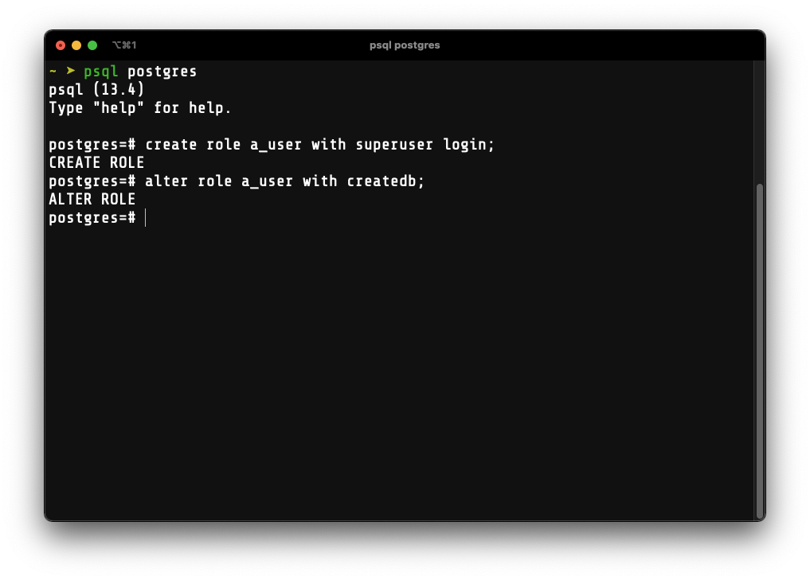

I am sure that for most of people reading my post are familiary with these two names: SQL and NoSQL.

For simplicity, I am only going to discuss and to guide you on how to use some of the SQL tools.
SQL or Relational Data Base Management System (RDBMS) is a way of storing data where data points are related to another.
Everything in a relational database is represented in tables, like in the picture below.


<i>
  *NOTE: Some of the commands are unique to MacOS. Please find out what commands
  to run specific to your operating system.
</i>

# 1. Installation

First, we have to install the SQL server that you intend to use.

```bash:title=Terminal
# MacOS
brew install postgresql
pip install --user sqlite3
```

To see if we have installed any of them properly, simply run

```bash:title=Terminal
postgresql --version # postgres (PostgreSQL) 13.4

sqlite3 --version # 3.32.3 ...
```

If you have `sqlite3` installed, just skip the second and the third steps since it doesn't need any servers and data in a table can be saved into `.db` file.
Once we have `postgresql` installed, let's ramp up the `postgresql` server and access it via a user called `postgres`. Simply run,

```bash:title=Terminal
brew services start postgresql
psql postgres
```


If you arent's sure that the `postgresql` server has not been ramped up, simply run

```bash:title=Terminal
brew services
```


# 2. Creating A User

Once the server is up, run `psql postgres` and it will redirect us to the postgresql interactive shell
Let's create a new superuser that allows us to create any databases on the server.

```sql:title=PostgreSQL Interactive Shell
CREATE USER a_user WITH SUPERUSER LOGIN;
ALTER ROLE a_user WITH CREATEDB;
```



`LOGIN` should be specified. Otherwise, the server will reject the logging in request.
Then run `\du` in the shell to see if `a_user` has been successfully created.


# 3. Running AN SQL Script

Below is a script that allows us to create IMDB film database automatically.
The script can be downloaded <a href="./script.sql">here</a>.
After running this script, we will expect 4 tables which are `films`, `people`, `reviews`, and `roles`.

```sql:title=script.sql
--
-- PostgreSQL database dump
--

-- Dumped from database version 9.6.3
-- Dumped by pg_dump version 9.6.3

SET statement_timeout = 0;
SET lock_timeout = 0;
SET idle_in_transaction_session_timeout = 0;
SET client_encoding = 'UTF8';
SET standard_conforming_strings = on;
SET check_function_bodies = false;
SET client_min_messages = warning;
SET row_security = off;
...
```

To run the script, simply run

```bash:title=Terminal
psql a_user -h localhost -d film_db -f films.sql
```

If you aren't sure what `-h`, `-d`, and `-f` mean, you can simply run `psql --help`.

After running the script, go back to the PostgreSQL interactive shell and access the film database using `a_user`.

```bash:title=Terminal
psql a_user -d film_db
```

To verify if the tables were created successfully, simply run `\dt` in the shell then you'll see the following result.

```sql:title=PostgreSQL Interactive Shell
            List of relations
 Schema |  Name   | Type  |     Owner
--------+---------+-------+---------------
 public | films   | table | a_user
 public | people  | table | a_user
 public | reviews | table | a_user
 public | roles   | table | a_user
(4 rows)
```

# 4. Accessing The Table With Python

Since we have PostgreSQL installed and a database in the server, we need to install `psycopg2` by running `pip install --user psycopg2`.

```python:title=database.py
import psycopg2

connection = psycopg2.connect(
  host='localhost',
  database='film_db',
  user='a_user'
)
cursor = connection.cursor()
```

Once we have a connection to the server, we want to see what tables are available in the `film_db` database.

```python:title=database.py
cursor.execute("""
  SELECT table_name FROM information_schema.tables
  WHERE table_schema = 'public'
""")

tables = [] # to store the name of each table in the database for future use
for table in cursor.fetchall():
    print(table[0])
    tables.append(table[0])
```

To show every row and every column of the data in `film` table, simply run

```python:title=database.py
cursor.execute("""
  SELECT * FROM films;
""")

for datum in cursor.fetchall():
    print(datum)
```

Say that we want to convert all the tables in the database into CSV files, add the following block of code to do so in the python script.

```python:title=database.py
for table in tables:
    sql = f"COPY (SELECT * FROM {table}) TO STDOUT WITH CSV HEADER DELIMITER ','"
    with open(f"./{table}.csv", "w") as file:
        cursor.copy_expert(sql, file, size=8192)
```

Now we have 4 different CSV files.
Here is the downside of CSV files: when the number of data in the CSV file increases, the resouces our computers need to read the file also increases.
There are some work around to avoid resource overconsumption by storing the data into Pickle files.
