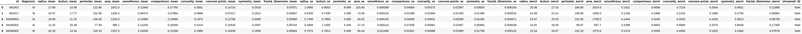
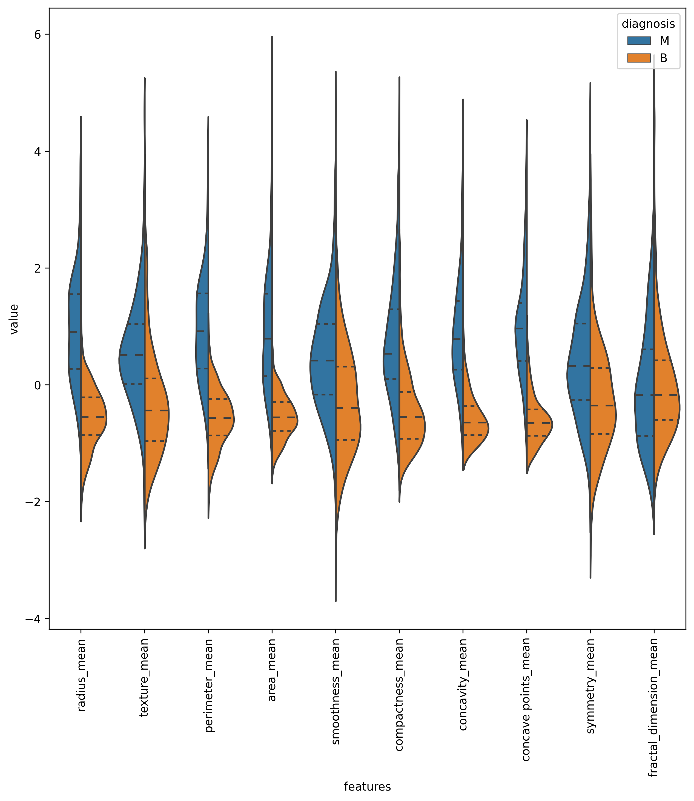
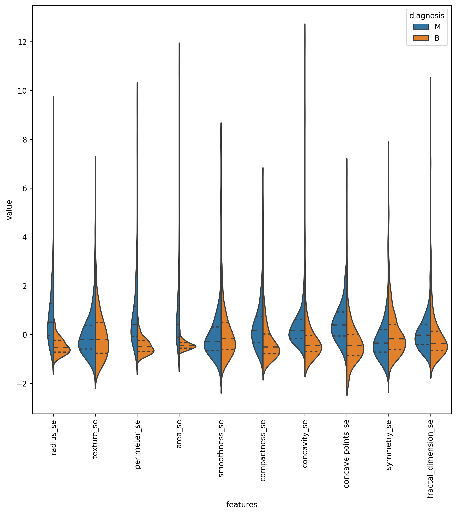
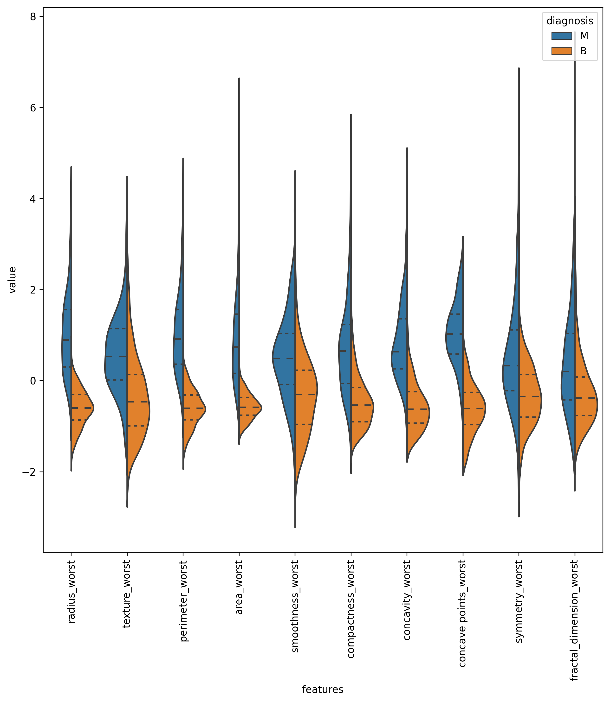

In this project, we are going to visualize [Breast Cancer Wisconsin Dataset](https://www.kaggle.com/uciml/breast-cancer-wisconsin-data)
from Kaggle. However, no code will present in this article. 
I only want to show important points worth mentioning.

Before we start, we want to look at the data like in the picture below.

Just by looking at the first five entries in the dataset above, we will immediately realize we don't need `id` and `Unnamed: 32` columns. 
Thus we can remove them out of the equation.

# 1. Data Explorations

We would want to visualize our data to see what insights we can gain from it. 
However, we first need to standardize our data in order to make sure the data looks consistent.
Without standardization, the data can look very skewed while being visualized.

After standardizing our data, we then can make violin plots on each feature.
Since we have 30 features, we then have to split them into 3 violin plots with each consisting 10 features.

