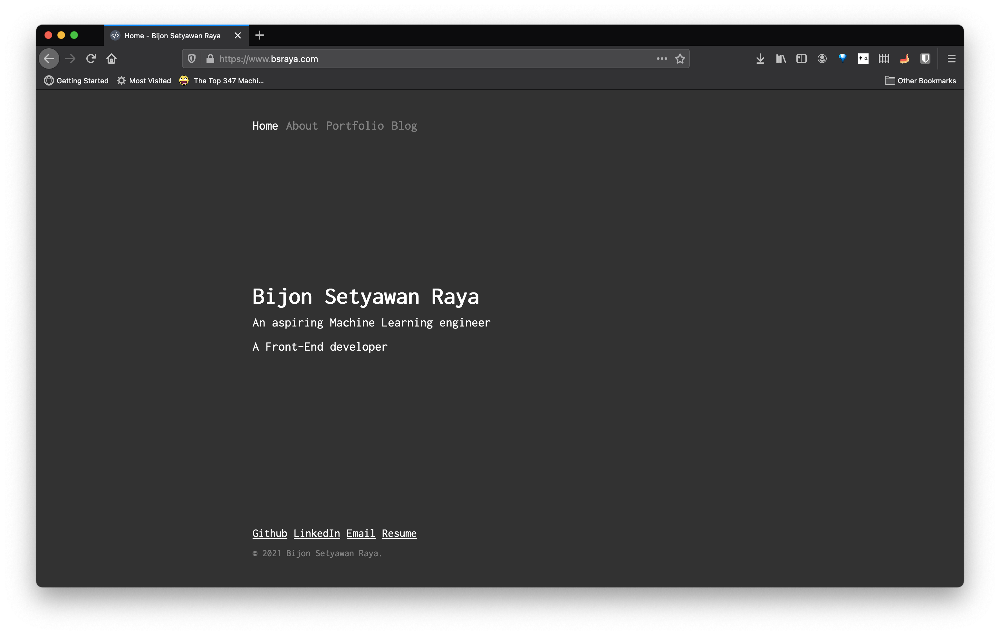

I made this website from scratch using a React-based, GraphQL powered, static site generator called [Gatsby.js](https://www.gatsbyjs.com).

There are many static site generators, such as [Hugo](https://gohugo.io/) and [Jekyll](https://jekyllrb.com/).
However, after a thorough research, I chose [Gatsby.js](https://www.gatsbyjs.com) since I wanted to get a better understanding in using [React](https://reactjs.org/).
In the process of developing this website, I started to see every website as a cluster of components where parent and child components communicating with each other by passing data or properties called `props`.
Simply said, I learned how to write better [React](https://reactjs.org/) code and, most importantly, to refactor my code all the time.

Not only I had learned some React related skills, I also learned how to reproduce and carefully elaborate the technical issues that I encountered in [Gatsby.js](https://www.gatsbyjs.com) community on Github.
[Gatsby.js](https://www.gatsbyjs.com) has a huge community which makes it friendly for beginners. In my spare time, I would help resolve the issues posted in the community.

After developing this website for quite some time, I realize that making a great and readable website requires a good understanding of web design and human behaviour.
Thus, I spent a significant amount of time on how to create a user-friendly website. Here is a list of things I learned:

1. Users love simple, blazing-fast websites
2. Users expect to find relevant information within seconds
3. Color combination and font size could affect reading experience

My personal website is the result of the aforementioned principles, and it will act as a medium where I can showcase my work and share my knowledge.

[Click here](https://github.com/nathansetyawan96/bsraya.com) to be redirected to this project's repo.

Tools: React.js, Gatsby.js, and GraphQL.js
