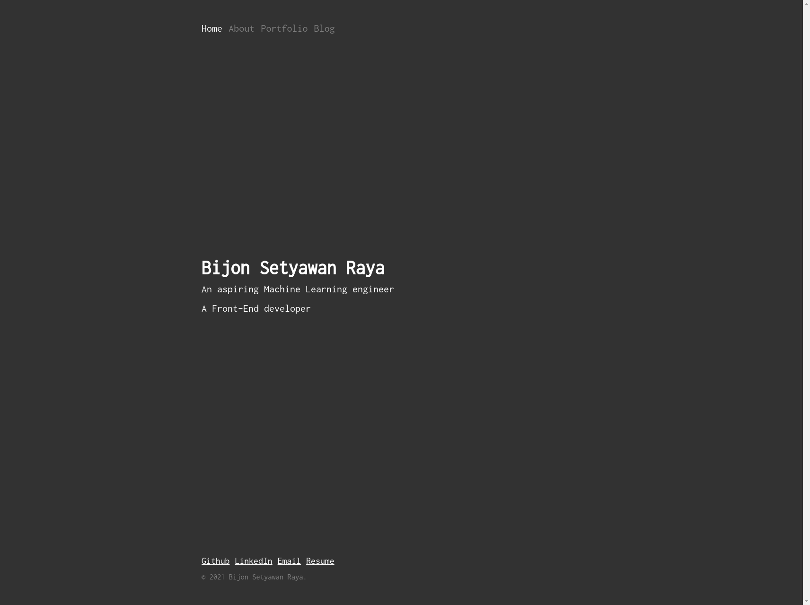

I made this website from scratch using a React-based, GraphQL powered, static site generator called [Gatsby.js](https://www.gatsbyjs.com).
It is intended to serve me as a medium where I can share my own work and ideas.

There are many static site generators, such as [Hugo](https://gohugo.io/) and [Jekyll](https://jekyllrb.com/). 
However, after a thorough research, I chose Gatsby.js since I wanted to get a better understanding in using React.
In the process of developing this website, I started to see every website as a cluster of components where parent and child components communicating with other by passing data or properties called `props`.
Simply said, I learned how to write better React code and, most importantly, to refactor my code all the time.

Not only I had learned some React related skills, I also learned how to reproduce and carefully elaborate the technical issues that I encountered in Gatsby.js community on Github.
Gatsby.js has a huge community which makes it friendly for beginners.

After developing this website for quite some time, I realize that to make a great, readable website requires a good understanding of design and human behaviour.

Since I want this website to be as simple as possible to navigat